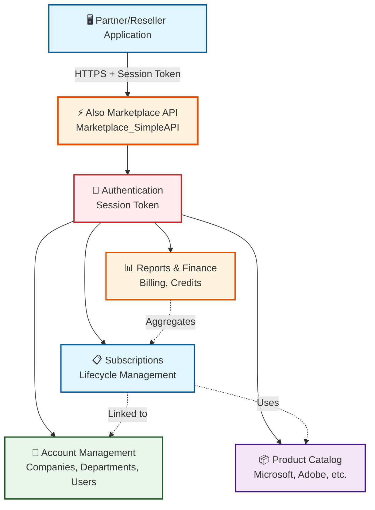
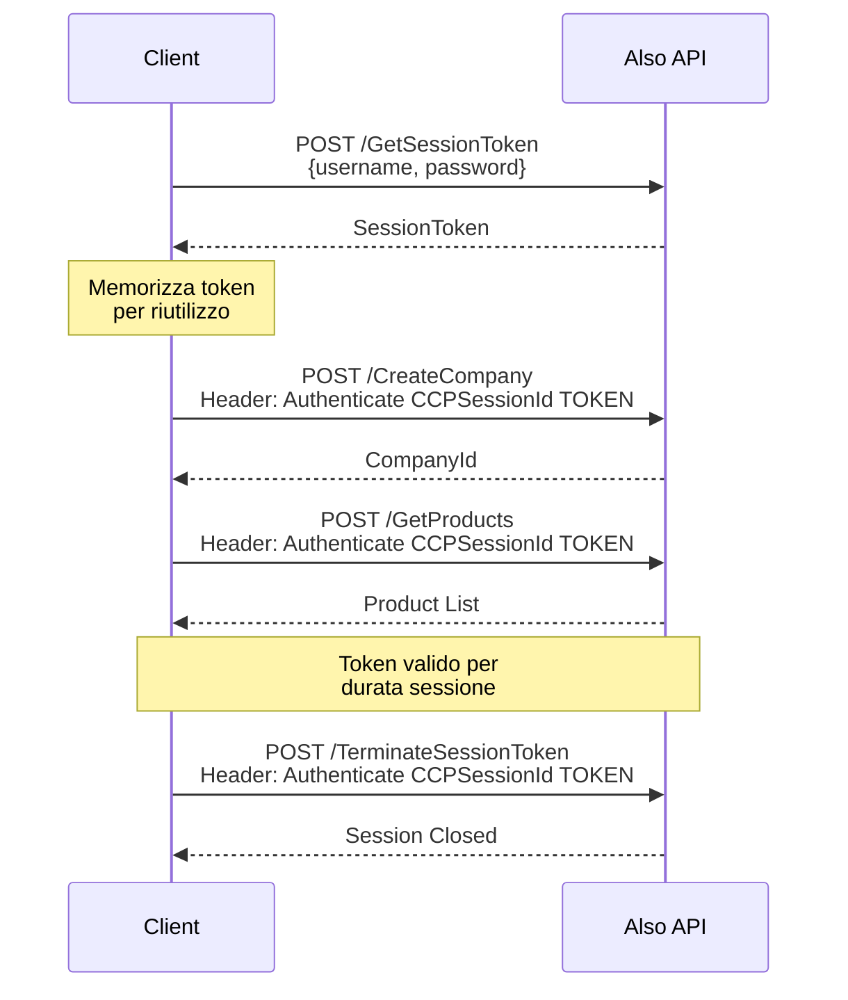
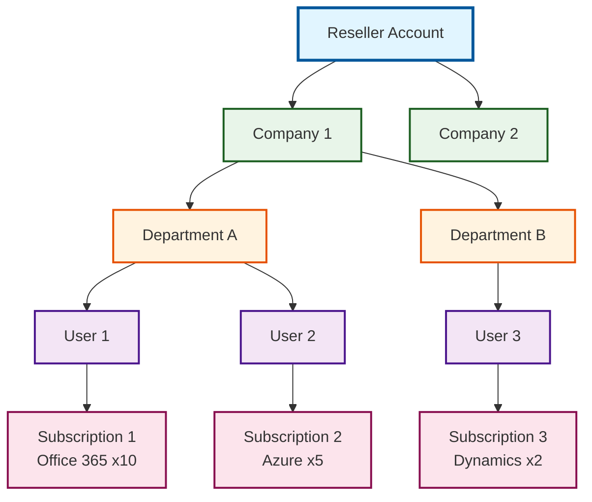
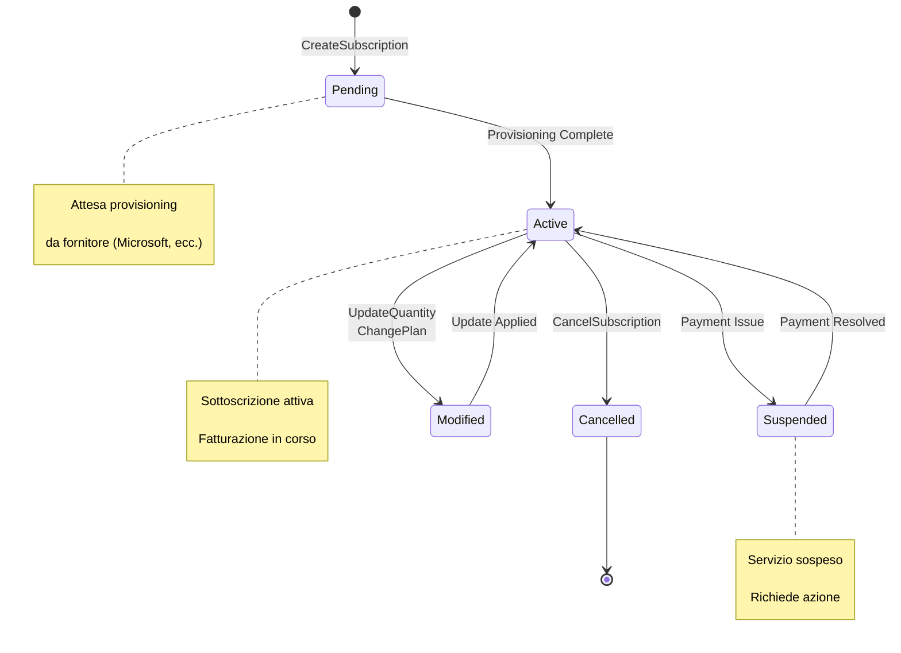

# Also Marketplace API - Documentation

Benvenuto nella documentazione dell'**API Also Marketplace**, la piattaforma cloud marketplace che consente di gestire sottoscrizioni, prodotti e account per soluzioni Microsoft e altre tecnologie cloud.

## 📚 Struttura della Documentazione

### OpenAPI Specification
- **[MarketplaceSimpleAPI-MarketplaceSimpleAPI-1.0.0-resolved.yaml](MarketplaceSimpleAPI-MarketplaceSimpleAPI-1.0.0-resolved.yaml)**: Specifica OpenAPI completa dell'API

### Guide Workflow

La directory `workflows/` contiene guide dettagliate per l'utilizzo dell'API:

1. **[0_Index.md](workflows/0_Index.md)**: Panoramica generale e indice di tutte le guide
2. **[1_Authentication.md](workflows/1_Authentication.md)**: Autenticazione con Session Token ⭐ **INIZIA DA QUI**
3. **[2_Account_Management.md](workflows/2_Account_Management.md)**: Gestione aziende, rivenditori e utenti
4. **[3_Marketplace_Catalog.md](workflows/3_Marketplace_Catalog.md)**: Catalogo prodotti e configurazione
5. **[4_Subscription_Management.md](workflows/4_Subscription_Management.md)**: Acquisto, modifica e cancellazione sottoscrizioni
6. **[5_Reports_and_Finance.md](workflows/5_Reports_and_Finance.md)**: Report di fatturazione e limiti di credito

## 🎯 Cosa fa Also Marketplace?

Also Marketplace è una piattaforma che fornisce:
- **Gestione Account** multi-livello (Company → Department → User)
- **Catalogo Prodotti** con Microsoft 365, Azure, e altre soluzioni cloud
- **Lifecycle Sottoscrizioni** completo (acquisto, upgrade, downgrade, cancellazione)
- **Billing & Reporting** con report finanziari e gestione crediti
- **API REST** per integrazioni B2B e portali di rivendita

## 🏗️ Architettura



## 🚀 Quick Start

### 1. Prerequisiti
- Credenziali Also Marketplace valide
- Accesso alle API (fornito da Also)
- Base URL: dipende dalla tua istanza

### 2. Autenticazione

```bash
# Ottieni Session Token
curl -X POST https://your-also-instance/GetSessionToken \
  -H "Content-Type: application/json" \
  -d '{
    "UserName": "YOUR_USERNAME",
    "Password": "YOUR_PASSWORD"
  }'

# Response: "C9C5MlqrpMwG/6bQ3mAVlm0Z6hi/eh1vsQs4i1I/g=="
```

### 3. Usa il Session Token

```bash
# Tutte le richieste successive richiedono l'header Authenticate
curl https://your-also-instance/GetProducts \
  -H "Content-Type: application/json" \
  -H "Authenticate: CCPSessionId YOUR_SESSION_TOKEN" \
  -d '{}'
```

## 📖 Esempi di Utilizzo

### Account Management

```bash
# Crea una nuova azienda
curl -X POST https://your-also-instance/CreateCompany \
  -H "Content-Type: application/json" \
  -H "Authenticate: CCPSessionId YOUR_TOKEN" \
  -d '{
    "CompanyName": "Acme Corporation",
    "Address": {
      "Street": "Via Roma 1",
      "City": "Milano",
      "PostalCode": "20100",
      "Country": "IT"
    },
    "Contact": {
      "FirstName": "Mario",
      "LastName": "Rossi",
      "Email": "mario.rossi@acme.it",
      "Phone": "+39 02 1234567"
    }
  }'

# Crea un utente
curl -X POST https://your-also-instance/CreateUser \
  -H "Content-Type: application/json" \
  -H "Authenticate: CCPSessionId YOUR_TOKEN" \
  -d '{
    "ParentAccountId": 100123,
    "UserName": "mario.rossi@acme.it",
    "FirstName": "Mario",
    "LastName": "Rossi",
    "Email": "mario.rossi@acme.it"
  }'
```

### Catalogo Prodotti

```bash
# Lista tutti i prodotti
curl -X POST https://your-also-instance/GetProducts \
  -H "Content-Type: application/json" \
  -H "Authenticate: CCPSessionId YOUR_TOKEN" \
  -d '{}'

# Ottieni dettagli prodotto
curl -X POST https://your-also-instance/GetProduct \
  -H "Content-Type: application/json" \
  -H "Authenticate: CCPSessionId YOUR_TOKEN" \
  -d '{
    "ProductId": "MS-0A-O365-ENTERPRIS"
  }'

# Verifica campi richiesti
curl -X POST https://your-also-instance/GetRequiredProductFields \
  -H "Content-Type: application/json" \
  -H "Authenticate: CCPSessionId YOUR_TOKEN" \
  -d '{
    "ProductId": "MS-0A-O365-ENTERPRIS"
  }'
```

### Gestione Sottoscrizioni

```bash
# Crea nuova sottoscrizione
curl -X POST https://your-also-instance/CreateSubscription \
  -H "Content-Type: application/json" \
  -H "Authenticate: CCPSessionId YOUR_TOKEN" \
  -d '{
    "ProductId": "MS-0A-O365-ENTERPRIS",
    "Quantity": 10,
    "BillingCycle": "Monthly",
    "ParentAccountId": 100123,
    "Parameters": [
      {
        "Name": "DomainPrefix",
        "Value": "acmecorp"
      }
    ]
  }'

# Aggiorna quantità
curl -X POST https://your-also-instance/UpdateSubscriptionQuantity \
  -H "Content-Type: application/json" \
  -H "Authenticate: CCPSessionId YOUR_TOKEN" \
  -d '{
    "SubscriptionId": "sub-12345",
    "Quantity": 15
  }'

# Cancella sottoscrizione
curl -X POST https://your-also-instance/CancelSubscription \
  -H "Content-Type: application/json" \
  -H "Authenticate: CCPSessionId YOUR_TOKEN" \
  -d '{
    "SubscriptionId": "sub-12345"
  }'
```

### Report e Finanza

```bash
# Report fatturazione
curl -X POST https://your-also-instance/GetBillingReport \
  -H "Content-Type: application/json" \
  -H "Authenticate: CCPSessionId YOUR_TOKEN" \
  -d '{
    "StartDate": "2026-02-01",
    "EndDate": "2026-02-28",
    "AccountId": 100123
  }'

# Ottieni limite di credito
curl -X POST https://your-also-instance/GetCreditLimit \
  -H "Content-Type: application/json" \
  -H "Authenticate: CCPSessionId YOUR_TOKEN" \
  -d '{
    "AccountId": 100123
  }'
```

## 🔐 Autenticazione

Also Marketplace utilizza **Session Token authentication**:

### Workflow Autenticazione



### Best Practices
- ✅ Memorizza il Session Token in modo sicuro
- ✅ Riutilizza lo stesso token per multiple richieste
- ✅ Implementa refresh automatico alla scadenza
- ✅ Chiama `/TerminateSessionToken` quando hai finito
- ❌ Non includere credenziali nel codice sorgente
- ❌ Non loggare i Session Token

## 🏢 Gerarchia Account



## 🔄 Lifecycle Sottoscrizione



## 🛠️ Sviluppo Backend

Il backend Node.js/TypeScript fornisce un layer REST per semplificare l'integrazione:

```bash
cd Also/backend
npm install
cp .env.example .env
# Configura ALSO_BASE_URL, ALSO_USERNAME, ALSO_PASSWORD
npm run dev
```

### Endpoint Backend

| Endpoint | Descrizione |
|----------|-------------|
| `POST /api/auth/login` | Ottieni session token |
| `POST /api/auth/logout` | Termina sessione |
| `GET /api/accounts/company` | Info azienda |
| `POST /api/accounts/resellers` | Crea reseller |
| `GET /api/catalog/products` | Lista prodotti |
| `GET /api/catalog/products/:id` | Dettagli prodotto |
| `POST /api/subscriptions` | Crea sottoscrizione |
| `PATCH /api/subscriptions/:id` | Aggiorna sottoscrizione |
| `DELETE /api/subscriptions/:id` | Cancella sottoscrizione |
| `GET /api/reports/billing` | Report fatturazione |

## 🔧 Troubleshooting

### Errori Comuni

| Errore | Causa | Soluzione |
|--------|-------|-----------|
| Session Token invalido | Token scaduto o errato | Richiedi nuovo token con `/GetSessionToken` |
| Parameter validation failed | Campi obbligatori mancanti | Verifica con `/GetRequiredProductFields` |
| Account not found | AccountId inesistente | Verifica AccountId con `/GetCompany` |
| Insufficient permissions | Permessi insufficienti | Contatta Also per permessi account |
| Product not available | Prodotto non più disponibile | Controlla catalogo aggiornato |

### Debug

```bash
# Test autenticazione
curl -v -X POST https://your-also-instance/GetSessionToken \
  -H "Content-Type: application/json" \
  -d '{"UserName":"user","Password":"pass"}'

# Test validità token
curl -X POST https://your-also-instance/PingPong \
  -H "Content-Type: application/json" \
  -H "Authenticate: CCPSessionId YOUR_TOKEN" \
  -d '{}'
```

## 📚 Risorse Aggiuntive

### Guide Workflow
- **[Authentication](workflows/1_Authentication.md)**: Setup e gestione session token
- **[Account Management](workflows/2_Account_Management.md)**: Creazione account hierarchy
- **[Marketplace Catalog](workflows/3_Marketplace_Catalog.md)**: Navigazione catalogo
- **[Subscription Management](workflows/4_Subscription_Management.md)**: Gestione completa sottoscrizioni
- **[Reports & Finance](workflows/5_Reports_and_Finance.md)**: Billing e reporting

### Backend README
- **Backend**: `Also/backend/README.md`

## 💡 Best Practices

1. **Autenticazione**:
   - Riutilizza Session Token per multiple richieste
   - Implementa auto-refresh prima della scadenza
   - Chiama sempre `/TerminateSessionToken` al termine

2. **Account Management**:
   - Segui gerarchia: Reseller → Company → Department → User
   - Memorizza AccountId per riferimenti futuri
   - Valida dati prima della creazione

3. **Sottoscrizioni**:
   - Verifica sempre campi richiesti con `/GetRequiredProductFields`
   - Testa in sandbox prima di produzione
   - Gestisci stati transitori (Pending, Provisioning)

4. **Performance**:
   - Batch operations quando possibile
   - Implementa caching per catalogo prodotti
   - Usa pagination per grandi dataset

5. **Error Handling**:
   - Log tutte le chiamate API
   - Gestisci retry per errori temporanei
   - Valida input prima di inviare richieste

## 🤝 Supporto

Per domande o problemi:
1. Consulta questa documentazione
2. Verifica i log dell'applicazione
3. Controlla OpenAPI specification
4. Contatta Also Support

## 📝 License

Questo backend è fornito come esempio di integrazione. Also Marketplace è un servizio commerciale di Also.

---

**Versione**: 1.0.0  
**Ultimo aggiornamento**: Febbraio 2026  
**Compatibilità API**: Also Marketplace SimpleAPI
