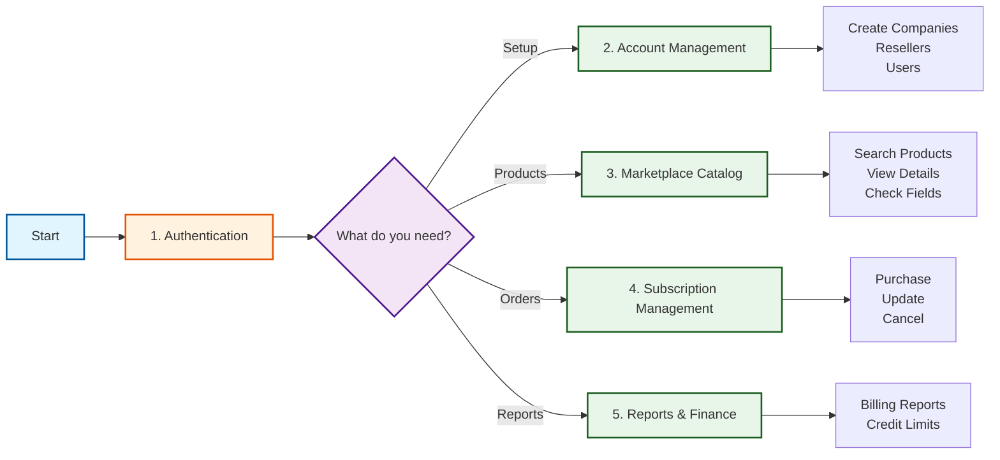

# Also Marketplace API Documentation

This directory contains workflow guides for the Also Marketplace API (`Marketplace_SimpleAPI`).

## API Workflow Overview

## Workflow Guides

1.  **Getting Started**:
    -   **[1_Authentication.md](1_Authentication.md)**: Authenticate with Session Tokens. **Start Here**.

2.  **Core Operations**:
    -   **[2_Account_Management.md](2_Account_Management.md)**: Create Companies, Resellers, and Users.
    -   **[3_Marketplace_Catalog.md](3_Marketplace_Catalog.md)**: Find products and required fields.
    -   **[4_Subscription_Management.md](4_Subscription_Management.md)**: Purchase, Update, and Cancel subscriptions.

3.  **Finance & Reporting**:
    -   **[5_Reports_and_Finance.md](5_Reports_and_Finance.md)**: Get billing reports and manage credit limits.
