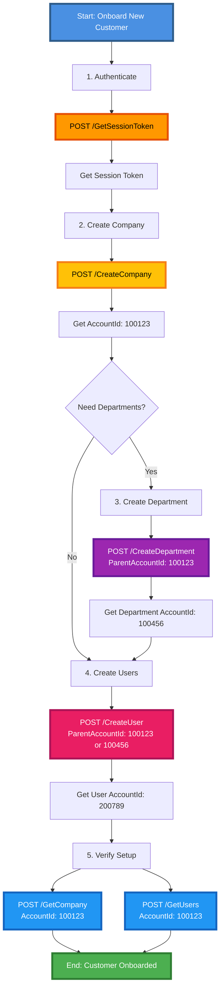

# Account Management Workflow Guide

## Overview
This guide covers how to manage the hierarchy of accounts in the Also Marketplace.
-   **Reseller**: The partner managing the customers (You).
-   **Company**: The end-customer organization that subscribes to services.
-   **Department**: Sub-units within a company for billing organization.
-   **User**: Individuals within a company or reseller.

## Authentication
Ensure you have a valid Session Token. Include it in the `Authenticate` header.
> See **[1_Authentication.md](1_Authentication.md)**.

---

## API Endpoints Reference

### Reseller Management

| Endpoint | Description |
| :--- | :--- |
| `POST /CreateReseller` | Creates a new reseller account |
| `POST /UpdateReseller` | Updates reseller details |
| `POST /GetReseller` | Gets a reseller by Account ID |
| `POST /GetResellers` | Lists resellers under a parent |
| `POST /GetResellerByVatId` | Searches for a reseller by VAT ID |

### Company Management

| Endpoint | Description |
| :--- | :--- |
| `POST /CreateCompany` | Creates a new company (end customer) |
| `POST /UpdateCompany` | Updates company details |
| `POST /GetCompany` | Gets a company by Account ID |
| `POST /GetCompanies` | Lists companies under a parent |
| `POST /GetCompanyByVatId` | Searches for a company by VAT ID |

### Department Management

| Endpoint | Description |
| :--- | :--- |
| `POST /CreateDepartment` | Creates a department under a company |
| `POST /UpdateDepartment` | Updates department details |
| `POST /GetDepartment` | Gets a specific department |
| `POST /GetDepartments` | Lists all departments under a parent |

### User Management

| Endpoint | Description |
| :--- | :--- |
| `POST /CreateUser` | Creates a user under a company or reseller |
| `POST /UpdateUser` | Updates user settings |
| `POST /GetUser` | Gets userdetails by Account ID |
| `POST /GetUsers` | Lists all users under a company |

### Account Termination

| Endpoint | Description |
| :--- | :--- |
| `POST /TerminateAccount` | Terminates any account (reseller, company, department, user, or subscription) |

---

## Common Workflows

### 1. Create a Company (End Customer)
**Goal**: Register a new customer organization so they can buy subscriptions.

**Prerequisites**:
- Must be authenticated
- Have appropriate permissions

**Request**:
`POST /CreateCompany`

**Body**:
```json
{
  "Company": {
    "ParentAccountId": 100001,
    "CompanyName": "New Customer GmbH",
    "Address": "Example St. 1",
    "City": "Berlin",
    "Country": "Germany",
    "Zip": "10115",
    "Email": "admin@customer.com",
    "Phone": "+49123456789",
    "VATID": "DE123456789",
    "Language": "en",
    "Currency": "EUR"
  }
}
```

**Response**:
Returns the created `Company` object with `AccountId`.
```json
{
  "AccountId": 100123,
  "ParentAccountId": 100001,
  "AccountState": "Active",
  "CompanyName": "New Customer GmbH",
  "VATID": "DE123456789",
  ...
}
```

**Crucial**: Save the `AccountId` (e.g., `100123`). You will need this to add subscriptions or users to this customer.

---

### 2. Update Company Details
**Goal**: Update address, contact info, or other company details.

**Request**:
`POST /UpdateCompany`

**Body**:
Include the `AccountId` to identify which company to update.
```json
{
  "Company": {
    "AccountId": 100123,
    "Address": "New Address St. 99",
    "City": "Munich",
    "Email": "newemail@customer.com"
  }
}
```

**Response**:
Returns nothing on success.

> [!NOTE]
> Works only for Account type Company, not for Resellers. Use `/UpdateReseller` for reseller accounts.

---

### 3. Search for Company by VAT ID
**Goal**: Find if a company already exists using their VAT ID.

**Request**:
`POST /GetCompanyByVatId`

**Body**:
```json
{
  "VatId": "DE123456789"
}
```

**Response**:
Returns an array of matching companies (can be multiple).

---

### 4. Create a Department
**Goal**: Organize billingsub-units within a company.

**Request**:
`POST /CreateDepartment`

**Body**:
```json
{
  "Department": {
    "ParentAccountId": 100123,
    "DepartmentName": "IT Department",
    "Address": "Optional address",
    "City": "Berlin",
    "Country": "Germany",
    "Zip": "10115",
    "Email": "it@customer.com"
  }
}
```

**Response**:
Returns the created `Departments` object with `AccountId`.

> [!TIP]
> If address fields are not specified, they are automatically taken from the parent company.

---

### 5. Create a User
**Goal**: Create a user under a specific company or reseller.

**Request**:
`POST /CreateUser`

**Body**:
```json
{
  "User": {
    "ParentAccountId": 100123,
    "Email": "user@customer.com",
    "FirstName": "Hans",
    "LastName": "Mueller",
    "Phone": "+49123456789",
    "Language": "en"
  }
}
```

**Response**:
Returns the created `User` object with `AccountId`.

> [!WARNING]
> Users cannot be added under other users. The parent must be a Company or Reseller.

---

### 6. Update User Details
**Goal**: Modify user information.

**Request**:
`POST /UpdateUser`

**Body**:
```json
{
  "User": {
    "AccountId": 200456,
    "FirstName": "Hans",
    "LastName": "Schmidt",
    "Email": "hans.schmidt@customer.com",
    "Phone": "+49987654321"
  }
}
```

> [!IMPORTANT]
> Even if you aren't updating FirstName or LastName, those parameters must always be provided.

---

### 7. List  Users
**Goal**: Find user IDs or check which users exist under a company.

**Request**:
`POST /GetUsers`

**Body**:
```json
{
  "AccountId": 100123
}
```

**Response**:
Returns a `Users` array containing all users under the specified company.

---

### 8. Get Single User
**Goal**: Retrieve details of a specific user.

**Request**:
`POST /GetUser`

**Body**:
```json
{
  "AccountId": 200456
}
```

**Response**:
Returns the `User` object.

> [!NOTE]
> If no AccountId is provided, returns the current session user's information.

---

### 9. Terminate an Account
**Goal**: Deactivate a company, department, user, or subscription.

**Request**:
`POST /TerminateAccount`

**Body**:
```json
{
  "AccountId": 100123,
  "Reason": "Customer requested cancellation"
}
```

**Response**:
Returns nothing on success.

> [!CAUTION]
> This action terminates the account. Use with care. Equivalent to the terminate action from the UI.

---

## Complete Workflow Example

### Scenario: Onboard a New Customer and Create Users



---

## Notes

- **Account Hierarchy**: Reseller → Company → Department → User → Subscription
- **All requests require authentication** via the `Authenticate` header
- **Case Sensitivity**: All body parameters are case sensitive
- **Errors**: All returned errors are in XML format
