# Unified API Proxy - Documentation

Benvenuto nella documentazione del **Unified API Proxy**, un gateway unificato che fornisce un singolo punto di accesso centralizzato per le API di Also Marketplace, TDSynnex StreamOne e Trend Vision One.

## 📚 Struttura della Documentazione

### OpenAPI Specification
- **[UnifiedAPIProxy-OpenAPI-1.0.0.yaml](UnifiedAPIProxy-OpenAPI-1.0.0.yaml)**: Specifica OpenAPI 3.0 completa del proxy

### Guide Workflow

La directory `workflows/` contiene guide dettagliate per l'utilizzo del proxy:

1. **[0_Index.md](workflows/0_Index.md)**: Panoramica generale e indice di tutte le guide
2. **[1_Getting_Started.md](workflows/1_Getting_Started.md)**: Setup iniziale, configurazione e primi passi ⭐ **INIZIA DA QUI**
3. **[2_Also_Integration.md](workflows/2_Also_Integration.md)**: Come utilizzare Also Marketplace API attraverso il proxy
4. **[3_TDSynnex_Integration.md](workflows/3_TDSynnex_Integration.md)**: Come utilizzare TDSynnex StreamOne API attraverso il proxy
5. **[4_Trend_Integration.md](workflows/4_Trend_Integration.md)**: Come utilizzare Trend Vision One API attraverso il proxy
6. **[5_Monitoring_and_Health.md](workflows/5_Monitoring_and_Health.md)**: Monitoraggio, logging e best practices operative

## 🎯 Cosa fa il Proxy?

Il Unified API Proxy è un reverse proxy che:
- **Centralizza l'accesso** a tre diverse API backend
- **Semplifica l'integrazione** fornendo un unico endpoint
- **Gestisce il routing** automatico basato sul prefisso URL
- **Fornisce logging centralizzato** per tutte le richieste
- **Offre health checks** per monitorare lo stato dei servizi

## 🏗️ Architettura

```mermaid
graph TB
    Client["🖥️ Applicazione Client<br/>(Web App, Mobile, etc.)"]
    
    Proxy["⚡ Unified API Proxy<br/>(Port 4000)<br/><br/>📍 Endpoints:<br/>• /api/also/*<br/>• /api/tdsynnex/*<br/>• /api/trend/*<br/>• /api/health<br/>• /api/status"]
    
    Also["🏢 Also Marketplace API<br/>Port 3001"]
    TDSynnex["☁️ TDSynnex StreamOne API<br/>Port 3002"]
    Trend["🛡️ Trend Vision One API<br/>Port 3003"]
    
    Client -->|HTTP/HTTPS| Proxy
    Proxy -->|Proxy /api/also/*| Also
    Proxy -->|Proxy /api/tdsynnex/*| TDSynnex
    Proxy -->|Proxy /api/trend/*| Trend
    
    style Client fill:#e1f5ff,stroke:#01579b,stroke-width:2px
    style Proxy fill:#fff3e0,stroke:#e65100,stroke-width:3px
    style Also fill:#f3e5f5,stroke:#4a148c,stroke-width:2px
    style TDSynnex fill:#e8f5e9,stroke:#1b5e20,stroke-width:2px
    style Trend fill:#fce4ec,stroke:#880e4f,stroke-width:2px
```



## 🚀 Quick Start

### 1. Prerequisiti
- Node.js 18+
- Le tre API backend devono essere in esecuzione:
  - Also Marketplace (http://localhost:3001)
  - TDSynnex StreamOne (http://localhost:3002)
  - Trend Vision One (http://localhost:3003)

### 2. Installazione

```bash
cd Proxy/backend
npm install
```

### 3. Configurazione

Crea il file `.env`:

```env
PORT=4000
NODE_ENV=development
LOG_LEVEL=info

ALSO_BASE_URL=http://localhost:3001
TDSYNNEX_BASE_URL=http://localhost:3002
TREND_BASE_URL=http://localhost:3003
```

### 4. Avvio

```bash
# Development
npm run dev

# Production
npm run build
npm start
```

### 5. Verifica

```bash
curl http://localhost:4000/api/health
```

## 📖 Esempi di Utilizzo

### Also Marketplace

```bash
# Login
curl -X POST http://localhost:4000/api/also/auth/login \
  -H "Content-Type: application/json" \
  -d '{"username": "user", "password": "pass"}'

# Elenco prodotti
curl http://localhost:4000/api/also/catalog/products \
  -H "Authenticate: CCPSessionId YOUR_TOKEN"
```

### TDSynnex StreamOne

```bash
# Ottieni OAuth token
curl -X POST http://localhost:4000/api/tdsynnex/auth/token \
  -H "Content-Type: application/json" \
  -d '{"client_id": "xxx", "client_secret": "yyy"}'

# Elenco clienti
curl http://localhost:4000/api/tdsynnex/customers \
  -H "Authorization: Bearer YOUR_TOKEN"
```

### Trend Vision One

```bash
# Elenco alert
curl http://localhost:4000/api/trend/alerts \
  -H "Authorization: Bearer YOUR_API_TOKEN"

# Dettagli endpoint
curl http://localhost:4000/api/trend/endpoints/EP123 \
  -H "Authorization: Bearer YOUR_API_TOKEN"
```

## 🔄 Mapping degli Endpoint

| Richiesta al Proxy | Inoltrata a | Backend |
|-------------------|-------------|---------|
| `GET /api/also/catalog/products` | `GET /api/catalog/products` | Also Marketplace (3001) |
| `GET /api/tdsynnex/customers` | `GET /api/customers` | TDSynnex (3002) |
| `GET /api/trend/alerts` | `GET /api/alerts` | Trend (3003) |

Il proxy rimuove automaticamente il prefisso (`/also`, `/tdsynnex`, `/trend`) e inoltra la richiesta al backend appropriato.

## 🔐 Autenticazione

Il proxy inoltra **trasparentemente** tutti gli header di autenticazione ai backend:

### Also Marketplace
```
Header: Authenticate: CCPSessionId <token>
```

### TDSynnex StreamOne
```
Header: Authorization: Bearer <oauth_token>
```

### Trend Vision One
```
Header: Authorization: Bearer <api_key>
```

Nessuna modifica è necessaria - il proxy mantiene gli header originali.

## 📊 Monitoraggio

### Health Check
```bash
curl http://localhost:4000/api/health
```

### Status Check
```bash
curl http://localhost:4000/api/status
```

### Logging

Il proxy utilizza Winston per il logging strutturato:

```json
{
  "level": "info",
  "message": "Proxying Also request: GET /api/catalog/products",
  "timestamp": "2026-02-06T10:30:00.000Z"
}
```

Configura il livello di log tramite `LOG_LEVEL` in `.env`:
- `error`: Solo errori
- `warn`: Warning ed errori
- `info`: Informazioni, warning ed errori (default)
- `debug`: Tutto inclusi dettagli di debug

## 🛠️ Sviluppo

### Struttura del Codice

```
Proxy/backend/src/
├── index.ts              # Entry point e configurazione Express
├── config/
│   └── index.ts          # Configurazione centralizzata
├── clients/
│   ├── AlsoClient.ts     # Client per Also API
│   ├── TDSynnexClient.ts # Client per TDSynnex API
│   └── TrendClient.ts    # Client per Trend API
├── routes/
│   ├── index.ts          # Router principale
│   ├── also.routes.ts    # Routes per Also
│   ├── tdsynnex.routes.ts# Routes per TDSynnex
│   └── trend.routes.ts   # Routes per Trend
├── middleware/
│   ├── errorHandler.ts   # Gestione errori
│   └── logger.ts         # Middleware logging
└── utils/
    └── logger.ts         # Configurazione Winston
```

### Testing

```bash
# Run tests
npm test

# Run with coverage
npm run test:coverage
```

## 🔧 Troubleshooting

### Il proxy non si avvia
1. Verifica che la porta 4000 sia libera
2. Controlla il file `.env` sia configurato correttamente
3. Verifica che tutte le dipendenze siano installate

### Backend non disponibile (503 errors)
1. Verifica che le API backend siano in esecuzione
2. Controlla le URL configurate in `.env`
3. Testa direttamente i backend senza il proxy

### Errori di autenticazione (401/403)
1. Verifica che gli header di autenticazione siano corretti
2. Controlla che i token non siano scaduti
3. Testa l'autenticazione diretta con i backend

## 📚 Risorse Aggiuntive

### Documentazione Backend
- **Also**: `Also/DOC/workflows/`
- **TDSynnex**: `TDSynnex/DOC/workflows/`
- **Trend**: `Trend/DOC/workflows/`

### README Backend
- **Proxy**: `Proxy/backend/README.md`
- **Also**: `Also/backend/README.md`
- **TDSynnex**: `TDSynnex/backend/README.md`
- **Trend**: `Trend/backend/README.md`

## 💡 Best Practices

1. **Sicurezza**:
   - Non loggare mai token o credenziali
   - Usa HTTPS in produzione
   - Implementa rate limiting
   - Valida tutti gli input

2. **Performance**:
   - Riutilizza le connessioni HTTP
   - Implementa caching quando appropriato
   - Monitora i tempi di risposta
   - Usa connection pooling

3. **Affidabilità**:
   - Implementa retry logic
   - Gestisci graceful shutdown
   - Monitora health dei backend
   - Configura timeout appropriati

4. **Monitoraggio**:
   - Configura alerting per errori
   - Monitora l'utilizzo delle risorse
   - Traccia le metriche delle richieste
   - Implementa distributed tracing

## 🤝 Supporto

Per domande o problemi:
1. Consulta questa documentazione
2. Verifica i log del proxy
3. Controlla lo stato dei backend
4. Contatta il team di supporto

## 📝 License

MIT License - vedi LICENSE file per dettagli

---

**Versione**: 1.0.0  
**Ultimo aggiornamento**: Febbraio 2026
