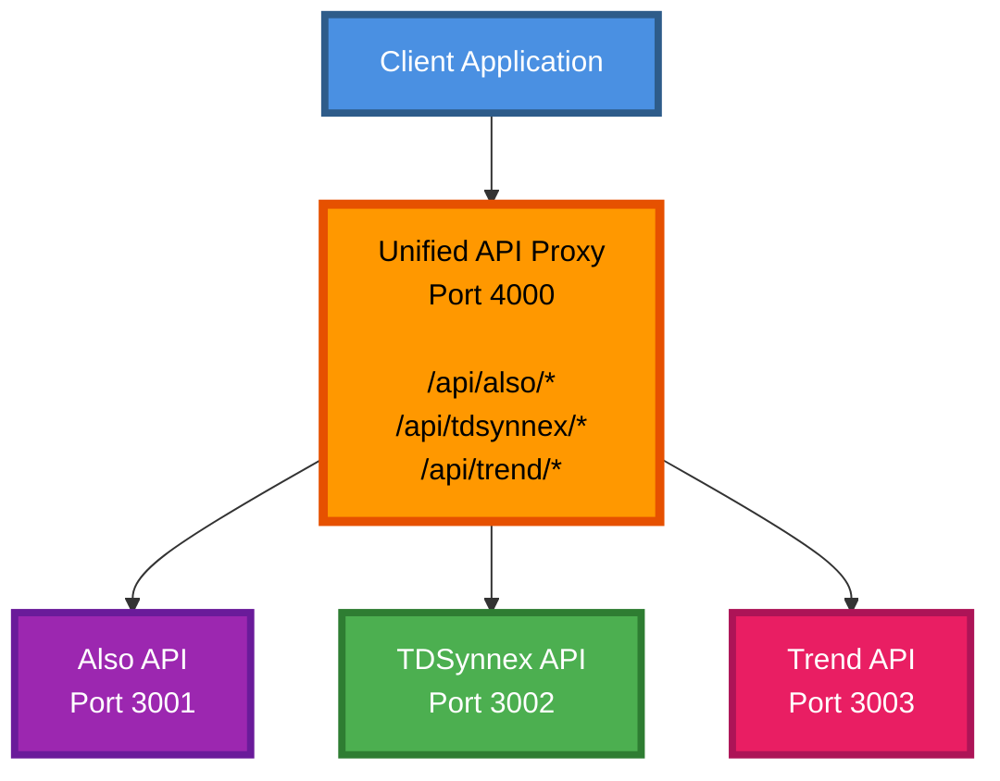

# Unified API Proxy Documentation

This directory contains workflow guides for the Unified API Proxy that provides centralized access to Also Marketplace, TDSynnex StreamOne, and Trend Vision One APIs.

## Workflow Guides

1.  **Getting Started**:
    -   **[1_Getting_Started.md](1_Getting_Started.md)**: Setup, configuration, and basic usage. **Start Here**.

2.  **API Integrations**:
    -   **[2_Also_Integration.md](2_Also_Integration.md)**: Route requests to Also Marketplace API.
    -   **[3_TDSynnex_Integration.md](3_TDSynnex_Integration.md)**: Route requests to TDSynnex StreamOne API.
    -   **[4_Trend_Integration.md](4_Trend_Integration.md)**: Route requests to Trend Vision One API.

3.  **Monitoring & Operations**:
    -   **[5_Monitoring_and_Health.md](5_Monitoring_and_Health.md)**: Health checks, status monitoring, and logging.

## Overview

The Unified API Proxy acts as a single gateway for accessing three different API backends:



## Key Features

- **Single Entry Point**: One proxy for three different APIs
- **Automatic Authentication**: Handles authentication for each backend API
- **Request Forwarding**: Transparent proxy with header and body forwarding
- **Centralized Logging**: Winston-based logging for all requests
- **Error Handling**: Unified error responses across all APIs
- **Health Monitoring**: Built-in health checks and status endpoints

## Quick Start

1. **Start the Proxy**:
   ```bash
   cd Proxy/backend
   npm install
   npm run dev
   ```

2. **Verify Status**:
   ```bash
   curl http://localhost:4000/api/status
   ```

3. **Route Requests**:
   ```bash
   # Also API
   curl http://localhost:4000/api/also/auth/login
   
   # TDSynnex API
   curl http://localhost:4000/api/tdsynnex/customers
   
   # Trend API
   curl http://localhost:4000/api/trend/alerts
   ```

## Authentication

The proxy handles authentication transparently for each backend:
- **Also**: Session token authentication (CCPSessionId)
- **TDSynnex**: OAuth2 Bearer tokens
- **Trend**: API Key authentication

Simply include the appropriate headers in your requests to the proxy, and they will be forwarded to the respective backend API.

## API Endpoints

### Health & Status
- `GET /api/health` - Health check
- `GET /api/status` - API status and version info

### Proxied APIs
- `* /api/also/*` - Forward to Also Marketplace API
- `* /api/tdsynnex/*` - Forward to TDSynnex StreamOne API
- `* /api/trend/*` - Forward to Trend Vision One API
