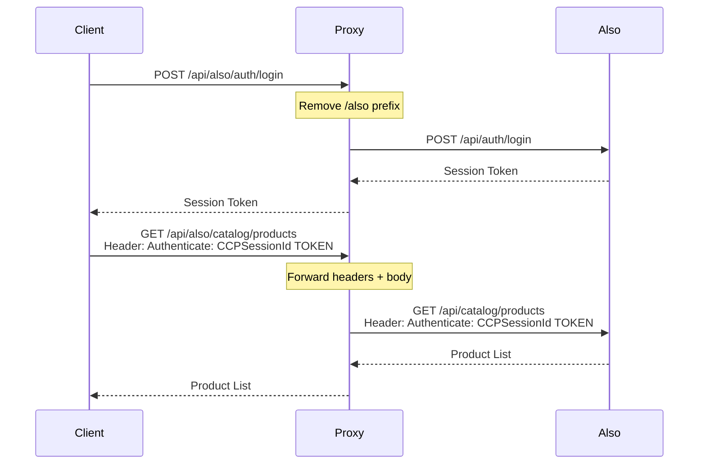

# Also Marketplace Integration - Unified API Proxy

## Overview
This guide explains how to access the Also Marketplace API through the Unified API Proxy. The proxy transparently forwards all Also-related requests to the Also backend while maintaining authentication and request context.

## Endpoint Structure

All Also Marketplace endpoints are accessed through the `/api/also` prefix:

| Proxy Endpoint | Forwarded To | Description |
|----------------|--------------|-------------|
| `POST /api/also/auth/login` | `POST http://localhost:3001/api/auth/login` | Get session token |
| `GET /api/also/catalog/products` | `GET http://localhost:3001/api/catalog/products` | List products |
| `POST /api/also/subscriptions` | `POST http://localhost:3001/api/subscriptions` | Create subscription |
| `GET /api/also/accounts` | `GET http://localhost:3001/api/accounts` | List accounts |

**Pattern**: `http://localhost:4000/api/also/*` → `http://localhost:3001/api/*`

## Authentication Workflow

### 1. Obtain Session Token

**Request to Proxy**:
```bash
curl -X POST http://localhost:4000/api/also/auth/login \
  -H "Content-Type: application/json" \
  -d '{
    "username": "YOUR_USERNAME",
    "password": "YOUR_PASSWORD"
  }'
```

**Response**:
```json
{
  "success": true,
  "token": "C9C5MlqrpMwG/6bQ3mAVlm0Z6hi/eh1vsQs4i1I/g==",
  "expiresAt": "2026-02-07T10:00:00.000Z"
}
```

### 2. Use Session Token in Subsequent Requests

Include the `Authenticate` header with the `CCPSessionId` prefix:

```bash
curl -X GET http://localhost:4000/api/also/catalog/products \
  -H "Authenticate: CCPSessionId C9C5MlqrpMwG/6bQ3mAVlm0Z6hi/eh1vsQs4i1I/g=="
```

## Common Operations

### Account Management

#### Get Company Information
```bash
curl -X GET http://localhost:4000/api/also/accounts/company \
  -H "Authenticate: CCPSessionId YOUR_SESSION_TOKEN"
```

#### Create Reseller Account
```bash
curl -X POST http://localhost:4000/api/also/accounts/resellers \
  -H "Content-Type: application/json" \
  -H "Authenticate: CCPSessionId YOUR_SESSION_TOKEN" \
  -d '{
    "name": "Acme Corp",
    "email": "contact@acme.com",
    "country": "IT"
  }'
```

### Catalog Operations

#### Search Products
```bash
curl -X GET "http://localhost:4000/api/also/catalog/products?search=microsoft" \
  -H "Authenticate: CCPSessionId YOUR_SESSION_TOKEN"
```

#### Get Product Details
```bash
curl -X GET http://localhost:4000/api/also/catalog/products/PROD123 \
  -H "Authenticate: CCPSessionId YOUR_SESSION_TOKEN"
```

### Subscription Management

#### Create New Subscription
```bash
curl -X POST http://localhost:4000/api/also/subscriptions \
  -H "Content-Type: application/json" \
  -H "Authenticate: CCPSessionId YOUR_SESSION_TOKEN" \
  -d '{
    "productId": "PROD123",
    "resellerId": "RES456",
    "quantity": 5,
    "billingCycle": "monthly"
  }'
```

#### Update Subscription
```bash
curl -X PATCH http://localhost:4000/api/also/subscriptions/SUB789 \
  -H "Content-Type: application/json" \
  -H "Authenticate: CCPSessionId YOUR_SESSION_TOKEN" \
  -d '{
    "quantity": 10
  }'
```

#### Cancel Subscription
```bash
curl -X DELETE http://localhost:4000/api/also/subscriptions/SUB789 \
  -H "Authenticate: CCPSessionId YOUR_SESSION_TOKEN"
```

### Reports and Finance

#### Get Billing Report
```bash
curl -X GET "http://localhost:4000/api/also/reports/billing?month=2026-02" \
  -H "Authenticate: CCPSessionId YOUR_SESSION_TOKEN"
```

#### Check Credit Limit
```bash
curl -X GET http://localhost:4000/api/also/accounts/credit-limit \
  -H "Authenticate: CCPSessionId YOUR_SESSION_TOKEN"
```

## Request Flow



## Error Handling

### Backend Not Available
```json
{
  "success": false,
  "message": "connect ECONNREFUSED 127.0.0.1:3001"
}
```
**Solution**: Ensure Also backend is running on port 3001

### Invalid Authentication
```json
{
  "success": false,
  "message": "Invalid session token",
  "code": "AUTH_INVALID_TOKEN"
}
```
**Solution**: Re-authenticate to get a new session token

### Invalid Request
```json
{
  "success": false,
  "message": "Validation error",
  "errors": [
    {
      "field": "productId",
      "message": "Product ID is required"
    }
  ]
}
```
**Solution**: Check request body and required fields

## Best Practices

1. **Session Token Management**:
   - Store session tokens securely
   - Implement token refresh before expiration
   - Handle 401 errors by re-authenticating

2. **Error Handling**:
   - Always check response status codes
   - Implement retry logic for transient failures
   - Log all errors for debugging

3. **Performance**:
   - Reuse session tokens across multiple requests
   - Implement connection pooling in your client
   - Cache catalog data when appropriate

4. **Security**:
   - Never log session tokens
   - Use HTTPS in production
   - Implement rate limiting in your client

## Complete Example

```javascript
// JavaScript/Node.js Example
const axios = require('axios');

const PROXY_BASE_URL = 'http://localhost:4000/api/also';

async function alsoWorkflow() {
  try {
    // 1. Authenticate
    const authResponse = await axios.post(`${PROXY_BASE_URL}/auth/login`, {
      username: 'YOUR_USERNAME',
      password: 'YOUR_PASSWORD'
    });
    
    const sessionToken = authResponse.data.token;
    
    // 2. Create axios instance with auth header
    const alsoApi = axios.create({
      baseURL: PROXY_BASE_URL,
      headers: {
        'Authenticate': `CCPSessionId ${sessionToken}`
      }
    });
    
    // 3. Search for products
    const products = await alsoApi.get('/catalog/products?search=microsoft');
    console.log('Products:', products.data);
    
    // 4. Create subscription
    const subscription = await alsoApi.post('/subscriptions', {
      productId: products.data.items[0].id,
      resellerId: 'RES123',
      quantity: 5,
      billingCycle: 'monthly'
    });
    console.log('Subscription created:', subscription.data);
    
    // 5. Get billing report
    const report = await alsoApi.get('/reports/billing?month=2026-02');
    console.log('Billing report:', report.data);
    
  } catch (error) {
    console.error('Error:', error.response?.data || error.message);
  }
}

alsoWorkflow();
```

## Related Documentation

- **Also API Direct Documentation**: See `Also/DOC/workflows/` for detailed Also API documentation
- **TDSynnex Integration**: [3_TDSynnex_Integration.md](3_TDSynnex_Integration.md)
- **Trend Integration**: [4_Trend_Integration.md](4_Trend_Integration.md)
- **Monitoring**: [5_Monitoring_and_Health.md](5_Monitoring_and_Health.md)
