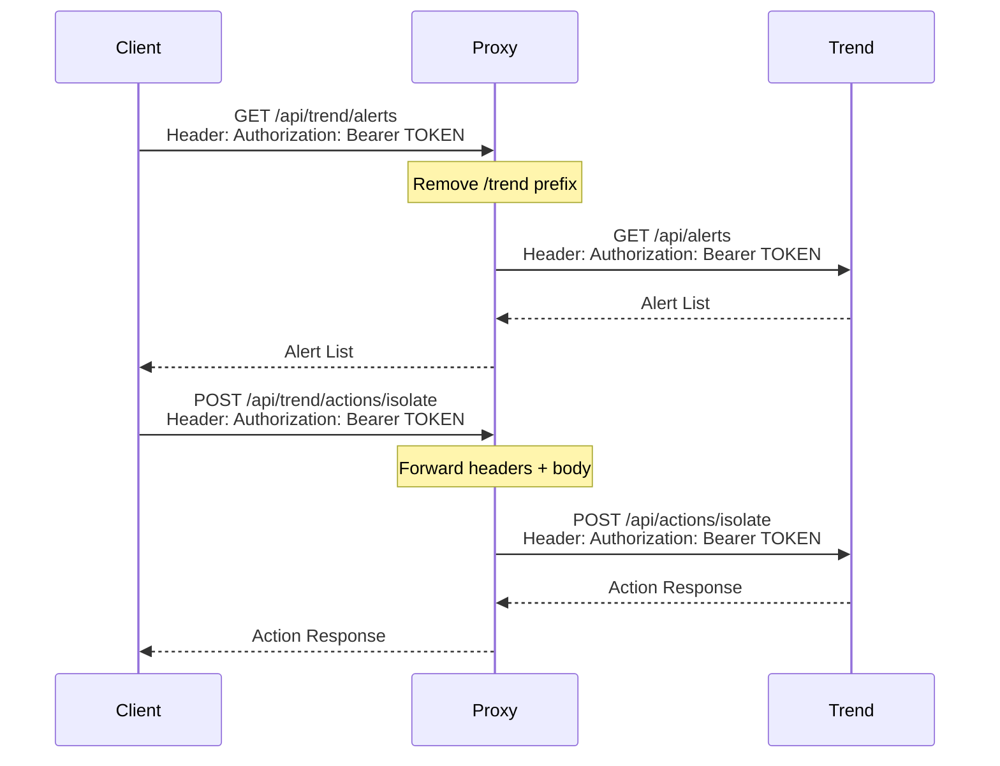

# Trend Vision One Integration - Unified API Proxy

## Overview
This guide explains how to access the Trend Vision One API through the Unified API Proxy. The proxy transparently forwards all Trend-related requests to the Trend Vision One backend while maintaining API key authentication and request context.

## Endpoint Structure

All Trend Vision One endpoints are accessed through the `/api/trend` prefix:

| Proxy Endpoint | Forwarded To | Description |
|----------------|--------------|-------------|
| `GET /api/trend/alerts` | `GET http://localhost:3003/api/alerts` | List alerts |
| `GET /api/trend/endpoints` | `GET http://localhost:3003/api/endpoints` | List endpoints |
| `POST /api/trend/actions/isolate` | `POST http://localhost:3003/api/actions/isolate` | Isolate endpoint |
| `GET /api/trend/workbench/alerts` | `GET http://localhost:3003/api/workbench/alerts` | Workbench alerts |

**Pattern**: `http://localhost:4000/api/trend/*` → `http://localhost:3003/api/*`

## Authentication

Trend Vision One uses API key authentication. Include your API token in the `Authorization` header with Bearer prefix:

```bash
curl -X GET http://localhost:4000/api/trend/alerts \
  -H "Authorization: Bearer YOUR_API_TOKEN"
```

The proxy forwards this header transparently to the Trend backend.

## Common Operations

### Alert Management

#### List All Alerts
```bash
curl -X GET http://localhost:4000/api/trend/alerts \
  -H "Authorization: Bearer YOUR_API_TOKEN"
```

#### Get Alert Details
```bash
curl -X GET http://localhost:4000/api/trend/alerts/ALERT123 \
  -H "Authorization: Bearer YOUR_API_TOKEN"
```

#### Filter Alerts by Severity
```bash
curl -X GET "http://localhost:4000/api/trend/alerts?severity=high&status=open" \
  -H "Authorization: Bearer YOUR_API_TOKEN"
```

**Response**:
```json
{
  "success": true,
  "data": {
    "items": [
      {
        "id": "ALERT123",
        "severity": "high",
        "status": "open",
        "title": "Ransomware detected",
        "description": "Suspicious encryption activity detected",
        "detectedAt": "2026-02-06T08:30:00Z",
        "endpoint": {
          "id": "EP456",
          "name": "DESKTOP-001",
          "ip": "192.168.1.100"
        }
      }
    ],
    "total": 1,
    "page": 1,
    "pageSize": 50
  }
}
```

#### Update Alert Status
```bash
curl -X PATCH http://localhost:4000/api/trend/alerts/ALERT123 \
  -H "Content-Type: application/json" \
  -H "Authorization: Bearer YOUR_API_TOKEN" \
  -d '{
    "status": "investigating",
    "assignedTo": "security.team@company.com",
    "notes": "Investigating ransomware alert"
  }'
```

### Endpoint Security

#### List Endpoints
```bash
curl -X GET http://localhost:4000/api/trend/endpoints \
  -H "Authorization: Bearer YOUR_API_TOKEN"
```

#### Get Endpoint Details
```bash
curl -X GET http://localhost:4000/api/trend/endpoints/EP456 \
  -H "Authorization: Bearer YOUR_API_TOKEN"
```

**Response**:
```json
{
  "success": true,
  "data": {
    "id": "EP456",
    "name": "DESKTOP-001",
    "ip": "192.168.1.100",
    "os": "Windows 11 Pro",
    "status": "online",
    "lastSeenAt": "2026-02-06T10:00:00Z",
    "agentVersion": "7.3.1234",
    "isolationStatus": "normal",
    "riskLevel": "medium"
  }
}
```

#### Search Endpoints
```bash
curl -X GET "http://localhost:4000/api/trend/endpoints?search=DESKTOP&os=Windows" \
  -H "Authorization: Bearer YOUR_API_TOKEN"
```

### Response Actions

#### Isolate Endpoint
```bash
curl -X POST http://localhost:4000/api/trend/actions/isolate \
  -H "Content-Type: application/json" \
  -H "Authorization: Bearer YOUR_API_TOKEN" \
  -d '{
    "endpointId": "EP456",
    "reason": "Ransomware detection",
    "duration": 3600
  }'
```

**Response**:
```json
{
  "success": true,
  "data": {
    "actionId": "ACTION789",
    "status": "pending",
    "endpointId": "EP456",
    "action": "isolate",
    "initiatedAt": "2026-02-06T10:15:00Z"
  }
}
```

#### Restore Endpoint Connection
```bash
curl -X POST http://localhost:4000/api/trend/actions/restore \
  -H "Content-Type: application/json" \
  -H "Authorization: Bearer YOUR_API_TOKEN" \
  -d '{
    "endpointId": "EP456",
    "reason": "Threat resolved"
  }'
```

#### Terminate Process
```bash
curl -X POST http://localhost:4000/api/trend/actions/terminate-process \
  -H "Content-Type: application/json" \
  -H "Authorization: Bearer YOUR_API_TOKEN" \
  -d '{
    "endpointId": "EP456",
    "processId": "malware.exe",
    "reason": "Malicious process detected"
  }'
```

#### Collect File
```bash
curl -X POST http://localhost:4000/api/trend/actions/collect-file \
  -H "Content-Type: application/json" \
  -H "Authorization: Bearer YOUR_API_TOKEN" \
  -d '{
    "endpointId": "EP456",
    "filePath": "C:\\Users\\Admin\\suspicious.exe",
    "description": "Collecting suspicious file for analysis"
  }'
```

### Workbench Alerts

#### Get Workbench Alert List
```bash
curl -X GET http://localhost:4000/api/trend/workbench/alerts \
  -H "Authorization: Bearer YOUR_API_TOKEN"
```

#### Get Workbench Alert Details
```bash
curl -X GET http://localhost:4000/api/trend/workbench/alerts/WB123 \
  -H "Authorization: Bearer YOUR_API_TOKEN"
```

**Response**:
```json
{
  "success": true,
  "data": {
    "id": "WB123",
    "model": "Ransomware",
    "score": 85,
    "severity": "high",
    "createdDateTime": "2026-02-06T08:00:00Z",
    "indicators": [
      {
        "type": "file",
        "value": "malware.exe",
        "confidence": "high"
      }
    ],
    "impactScope": {
      "desktopCount": 1,
      "serverCount": 0,
      "accountCount": 1
    }
  }
}
```

#### Update Workbench Alert Status
```bash
curl -X PATCH http://localhost:4000/api/trend/workbench/alerts/WB123 \
  -H "Content-Type: application/json" \
  -H "Authorization: Bearer YOUR_API_TOKEN" \
  -d '{
    "status": "closed",
    "investigationStatus": "benign",
    "comment": "False positive - legitimate software"
  }'
```

### Threat Intelligence

#### Get Suspicious Objects
```bash
curl -X GET "http://localhost:4000/api/trend/suspicious-objects?type=file&riskLevel=high" \
  -H "Authorization: Bearer YOUR_API_TOKEN"
```

#### Add to Exception List
```bash
curl -X POST http://localhost:4000/api/trend/exceptions \
  -H "Content-Type: application/json" \
  -H "Authorization: Bearer YOUR_API_TOKEN" \
  -d '{
    "type": "file",
    "value": "legitimate-app.exe",
    "description": "Approved corporate application"
  }'
```

### Account and Settings

#### Get API Quota
```bash
curl -X GET http://localhost:4000/api/trend/account/quota \
  -H "Authorization: Bearer YOUR_API_TOKEN"
```

**Response**:
```json
{
  "success": true,
  "data": {
    "limit": 10000,
    "used": 1234,
    "remaining": 8766,
    "resetAt": "2026-03-01T00:00:00Z"
  }
}
```

## Request Flow



## Error Handling

### Backend Not Available
```json
{
  "success": false,
  "message": "connect ECONNREFUSED 127.0.0.1:3003"
}
```
**Solution**: Ensure Trend backend is running on port 3003

### Invalid API Token
```json
{
  "success": false,
  "error": {
    "code": "Unauthorized",
    "message": "Invalid API token"
  }
}
```
**Solution**: Verify your API token is correct and not expired

### Rate Limit Exceeded
```json
{
  "success": false,
  "error": {
    "code": "TooManyRequests",
    "message": "API rate limit exceeded"
  }
}
```
**Solution**: Wait before making more requests or increase your quota

### Resource Not Found
```json
{
  "success": false,
  "error": {
    "code": "NotFound",
    "message": "Alert not found"
  }
}
```
**Solution**: Verify the resource ID exists

## Best Practices

1. **API Token Management**:
   - Store API tokens securely (environment variables, secrets manager)
   - Never commit tokens to source control
   - Rotate tokens regularly
   - Use different tokens for development and production

2. **Alert Management**:
   - Implement automated alert filtering based on severity
   - Set up alerting for high-severity incidents
   - Regularly review and close resolved alerts
   - Document investigation findings

3. **Response Actions**:
   - Always document the reason for isolation actions
   - Test isolation procedures in a lab environment first
   - Have a rollback plan before isolating production systems
   - Monitor isolated endpoints closely

4. **Rate Limiting**:
   - Check API quota before bulk operations
   - Implement exponential backoff for retries
   - Use pagination for large data sets
   - Cache responses when appropriate

5. **Error Handling**:
   - Log all API errors with context
   - Implement retry logic for transient failures
   - Handle 401/403 errors gracefully
   - Monitor for repeated errors

## Complete Example

```javascript
// JavaScript/Node.js Example
const axios = require('axios');

const PROXY_BASE_URL = 'http://localhost:4000/api/trend';
const API_TOKEN = process.env.TREND_API_TOKEN;

async function trendWorkflow() {
  try {
    // Create axios instance with auth header
    const trendApi = axios.create({
      baseURL: PROXY_BASE_URL,
      headers: {
        'Authorization': `Bearer ${API_TOKEN}`
      }
    });
    
    // 1. Get high severity alerts
    const alerts = await trendApi.get('/alerts?severity=high&status=open');
    console.log('High severity alerts:', alerts.data);
    
    if (alerts.data.data.items.length > 0) {
      const alert = alerts.data.data.items[0];
      
      // 2. Get alert details
      const alertDetails = await trendApi.get(`/alerts/${alert.id}`);
      console.log('Alert details:', alertDetails.data);
      
      // 3. Get affected endpoint details
      const endpoint = await trendApi.get(`/endpoints/${alert.endpoint.id}`);
      console.log('Endpoint details:', endpoint.data);
      
      // 4. If critical, isolate the endpoint
      if (alert.severity === 'critical') {
        const isolateAction = await trendApi.post('/actions/isolate', {
          endpointId: alert.endpoint.id,
          reason: `Critical alert: ${alert.title}`,
          duration: 7200 // 2 hours
        });
        console.log('Isolation action:', isolateAction.data);
      }
      
      // 5. Update alert status
      await trendApi.patch(`/alerts/${alert.id}`, {
        status: 'investigating',
        assignedTo: 'security-team@company.com',
        notes: 'Automated investigation initiated'
      });
      
      // 6. Check workbench alerts
      const workbenchAlerts = await trendApi.get('/workbench/alerts');
      console.log('Workbench alerts:', workbenchAlerts.data);
    }
    
    // 7. Check API quota
    const quota = await trendApi.get('/account/quota');
    console.log('API Quota:', quota.data);
    
  } catch (error) {
    console.error('Error:', error.response?.data || error.message);
  }
}

trendWorkflow();
```

## Automated Response Example

```javascript
// Automated incident response workflow
async function autoRespond() {
  const trendApi = axios.create({
    baseURL: PROXY_BASE_URL,
    headers: { 'Authorization': `Bearer ${API_TOKEN}` }
  });
  
  // Get critical alerts
  const response = await trendApi.get('/alerts?severity=critical&status=open');
  const alerts = response.data.data.items;
  
  for (const alert of alerts) {
    console.log(`Processing alert: ${alert.id}`);
    
    // Isolate affected endpoint
    await trendApi.post('/actions/isolate', {
      endpointId: alert.endpoint.id,
      reason: `Auto-isolation: ${alert.title}`
    });
    
    // Collect suspicious file if present
    if (alert.indicators?.file) {
      await trendApi.post('/actions/collect-file', {
        endpointId: alert.endpoint.id,
        filePath: alert.indicators.file.path,
        description: 'Automated forensic collection'
      });
    }
    
    // Update alert
    await trendApi.patch(`/alerts/${alert.id}`, {
      status: 'investigating',
      notes: 'Automated response: endpoint isolated, file collected'
    });
    
    // Send notification (custom implementation)
    await sendNotification({
      title: 'Critical Security Alert',
      message: `Endpoint ${alert.endpoint.name} isolated due to ${alert.title}`,
      alert: alert
    });
  }
}
```

## Webhooks Integration

If you need real-time alerts, consider setting up webhooks at the Trend backend level. The proxy will transparently forward webhook configuration requests:

```bash
curl -X POST http://localhost:4000/api/trend/webhooks \
  -H "Content-Type: application/json" \
  -H "Authorization: Bearer YOUR_API_TOKEN" \
  -d '{
    "url": "https://your-server.com/webhooks/trend",
    "events": ["alert.created", "alert.updated", "endpoint.isolated"],
    "secret": "YOUR_WEBHOOK_SECRET"
  }'
```

## Related Documentation

- **Trend API Direct Documentation**: See `Trend/DOC/workflows/` for detailed Trend Vision One API documentation
- **Also Integration**: [2_Also_Integration.md](2_Also_Integration.md)
- **TDSynnex Integration**: [3_TDSynnex_Integration.md](3_TDSynnex_Integration.md)
- **Monitoring**: [5_Monitoring_and_Health.md](5_Monitoring_and_Health.md)
