# TDSynnex StreamOne API - Documentation

Benvenuto nella documentazione dell'**API TDSynnex StreamOne®**, la piattaforma cloud commerce che consente ai partner di distribuire e gestire soluzioni cloud Microsoft, Adobe, e altri vendor attraverso un ecosistema unificato.

## 📚 Struttura della Documentazione

### OpenAPI Specification
- **[API reference.yaml](API%20reference.yaml)**: Specifica completa OpenAPI dell'API StreamOne® Ion

### Guide Workflow

La directory `workflows/` contiene guide dettagliate per l'utilizzo dell'API:

1. **[0_Index.md](workflows/0_Index.md)**: Panoramica generale e indice di tutte le guide
2. **[1_Authentication.md](workflows/1_Authentication.md)**: OAuth2 authentication flow ⭐ **INIZIA DA QUI**
3. **[2_Customer_Management.md](workflows/2_Customer_Management.md)**: Gestione clienti finali
4. **[3_Product_Catalog.md](workflows/3_Product_Catalog.md)**: Catalogo prodotti e pricing
5. **[4_Shopping_Cart.md](workflows/4_Shopping_Cart.md)**: Carrello e checkout
6. **[5_Orders_and_Subscriptions.md](workflows/5_Orders_and_Subscriptions.md)**: Ordini e gestione sottoscrizioni
7. **[6_Reports_and_Provisioning.md](workflows/6_Reports_and_Provisioning.md)**: Report e provisioning schemas

## 🎯 Cosa fa TDSynnex StreamOne?

StreamOne® Ion è una piattaforma cloud commerce che fornisce:
- **Customer Management** completo per end-customer lifecycle
- **Product Catalog** con migliaia di SKU Microsoft, Adobe, AWS, Google
- **Shopping Cart** e checkout experience B2B
- **Order Management** con tracking stato e fulfillment
- **Subscription Lifecycle** automatizzato (provisioning, renewal, termination)
- **Billing & Reporting** con invoice e usage data

## 🏗️ Architettura

```mermaid
graph TB
    Partner["🏢 Cloud Service Provider<br/>(Partner/Reseller)"]
    
    API["⚡ TDSynnex StreamOne® API<br/>Ion Platform"]
    
    OAuth["🔐 OAuth2 Authentication<br/>Access & Refresh Tokens"]
    Customers["👥 Customer Management<br/>End-Customer Accounts"]
    Catalog["📦 Product Catalog<br/>Multi-Vendor Products"]
    Cart["🛒 Shopping Cart<br/>Quote & Checkout"]
    Orders["📋 Orders & Subscriptions<br/>Fulfillment & Provisioning"]
    Reports["📊 Reports & Billing<br/>Usage & Invoices"]
    
    Partner -->|HTTPS + OAuth2| API
    
    API --> OAuth
    OAuth --> Customers
    OAuth --> Catalog
    OAuth --> Cart
    OAuth --> Orders
    OAuth --> Reports
    
    Cart -.->|Linked to| Customers
    Cart -.->|Contains| Catalog
    Orders -.->|Created from| Cart
    Reports -.->|Aggregates| Orders
    
    style Partner fill:#4A90E2,stroke:#2E5C8A,stroke-width:4px,color:#fff
    style API fill:#FF9800,stroke:#E65100,stroke-width:5px,color:#000
    style OAuth fill:#F44336,stroke:#C62828,stroke-width:4px,color:#fff
    style Customers fill:#4CAF50,stroke:#2E7D32,stroke-width:4px,color:#fff
    style Catalog fill:#9C27B0,stroke:#6A1B9A,stroke-width:4px,color:#fff
    style Cart fill:#2196F3,stroke:#1565C0,stroke-width:4px,color:#fff
    style Orders fill:#FFC107,stroke:#F57F17,stroke-width:4px,color:#000
    style Reports fill:#E91E63,stroke:#AD1457,stroke-width:4px,color:#fff
```



## 🚀 Quick Start

### 1. Prerequisiti
- Account TDSynnex StreamOne attivo
- Client ID e Client Secret (forniti da TDSynnex)
- Ambiente sandbox per test

### 2. Autenticazione OAuth2

```bash
# Ottieni Access Token
curl -X POST https://api.streamoneion.com/oauth/token \
  -H "Content-Type: application/json" \
  -d '{
    "client_id": "YOUR_CLIENT_ID",
    "client_secret": "YOUR_CLIENT_SECRET",
    "grant_type": "client_credentials",
    "scope": "customers products orders"
  }'

# Response
{
  "access_token": "eyJhbGciOiJSUzI1NiIsInR5cCI6IkpXVCJ9...",
  "token_type": "Bearer",
  "expires_in": 3600,
  "refresh_token": "def502004a8b3c..."
}
```

### 3. Usa l'Access Token

```bash
# Tutte le richieste successive richiedono header Authorization
curl https://api.streamoneion.com/v1/customers \
  -H "Authorization: Bearer YOUR_ACCESS_TOKEN"
```

## 📖 Esempi di Utilizzo

### Customer Management

```bash
# Crea nuovo cliente
curl -X POST https://api.streamoneion.com/v1/customers \
  -H "Authorization: Bearer YOUR_TOKEN" \
  -H "Content-Type: application/json" \
  -d '{
    "companyName": "Acme Corporation",
    "email": "admin@acme.com",
    "country": "US",
    "address": {
      "street": "123 Main St",
      "city": "New York",
      "state": "NY",
      "postalCode": "10001"
    },
    "contact": {
      "firstName": "John",
      "lastName": "Doe",
      "email": "john.doe@acme.com",
      "phone": "+1-555-123-4567"
    }
  }'

# Lista clienti
curl https://api.streamoneion.com/v1/customers \
  -H "Authorization: Bearer YOUR_TOKEN"

# Dettagli cliente
curl https://api.streamoneion.com/v1/customers/CUST-12345 \
  -H "Authorization: Bearer YOUR_TOKEN"
```

### Product Catalog

```bash
# Cerca prodotti
curl "https://api.streamoneion.com/v1/products?search=office365&vendor=Microsoft" \
  -H "Authorization: Bearer YOUR_TOKEN"

# Dettagli prodotto
curl https://api.streamoneion.com/v1/products/PROD-67890 \
  -H "Authorization: Bearer YOUR_TOKEN"

# Pricing prodotto
curl https://api.streamoneion.com/v1/products/PROD-67890/pricing \
  -H "Authorization: Bearer YOUR_TOKEN"
```

### Shopping Cart

```bash
# Crea carrello
curl -X POST https://api.streamoneion.com/v1/carts \
  -H "Authorization: Bearer YOUR_TOKEN" \
  -H "Content-Type: application/json" \
  -d '{
    "customerId": "CUST-12345"
  }'

# Aggiungi item al carrello
curl -X POST https://api.streamoneion.com/v1/carts/CART-ABC/items \
  -H "Authorization: Bearer YOUR_TOKEN" \
  -H "Content-Type: application/json" \
  -d '{
    "productId": "PROD-67890",
    "quantity": 10,
    "billingCycle": "monthly"
  }'

# Checkout
curl -X POST https://api.streamoneion.com/v1/carts/CART-ABC/checkout \
  -H "Authorization: Bearer YOUR_TOKEN" \
  -H "Content-Type: application/json" \
  -d '{
    "purchaseOrderNumber": "PO-2026-001"
  }'
```

### Orders & Subscriptions

```bash
# Lista ordini
curl "https://api.streamoneion.com/v1/orders?customerId=CUST-12345" \
  -H "Authorization: Bearer YOUR_TOKEN"

# Dettagli ordine
curl https://api.streamoneion.com/v1/orders/ORD-99999 \
  -H "Authorization: Bearer YOUR_TOKEN"

# Aggiorna quantità sottoscrizione
curl -X PATCH https://api.streamoneion.com/v1/subscriptions/SUB-55555 \
  -H "Authorization: Bearer YOUR_TOKEN" \
  -H "Content-Type: application/json" \
  -d '{
    "quantity": 15
  }'

# Cancella sottoscrizione
curl -X POST https://api.streamoneion.com/v1/subscriptions/SUB-55555/cancel \
  -H "Authorization: Bearer YOUR_TOKEN" \
  -H "Content-Type: application/json" \
  -d '{
    "reason": "Customer request",
    "cancellationType": "immediate"
  }'
```

## 🔐 Autenticazione OAuth2

TDSynnex StreamOne utilizza **OAuth 2.0 Client Credentials Flow**:

### OAuth2 Flow


### Token Management
- ✅ Access Token valido per ~1 ora
- ✅ Refresh Token prima della scadenza
- ✅ Memorizza tokens in modo sicuro (encrypted storage)
- ✅ Implementa auto-refresh automatico
- ❌ Non includere credentials nel codice sorgente

## 🛒 Shopping Cart Workflow


## 📦 Order Lifecycle


## 🛠️ Sviluppo Backend

Il backend Node.js/TypeScript fornisce un layer REST per semplificare l'integrazione:

```bash
cd TDSynnex/backend
npm install
cp .env.example .env
# Configura TDSYNNEX_CLIENT_ID, TDSYNNEX_CLIENT_SECRET, TDSYNNEX_BASE_URL
npm run dev
```

### Endpoint Backend

| Endpoint | Descrizione |
|----------|-------------|
| `POST /api/auth/token` | Ottieni OAuth2 token |
| `POST /api/auth/refresh` | Refresh access token |
| `GET /api/customers` | Lista clienti |
| `POST /api/customers` | Crea cliente |
| `GET /api/products` | Cerca prodotti |
| `GET /api/products/:id` | Dettagli prodotto |
| `POST /api/carts` | Crea carrello |
| `POST /api/carts/:id/items` | Aggiungi item |
| `POST /api/orders` | Crea ordine |
| `GET /api/orders/:id` | Dettagli ordine |
| `PATCH /api/subscriptions/:id` | Aggiorna sottoscrizione |

## 🔧 Troubleshooting

### Errori Comuni

| Errore | Causa | Soluzione |
|--------|-------|-----------|
| 401 Unauthorized | Token invalido o scaduto | Refresh o richiedi nuovo token |
| 403 Forbidden | Permessi insufficienti | Verifica scope OAuth2 |
| 404 Not Found | Risorsa inesistente | Verifica ID risorsa |
| 422 Unprocessable Entity | Validazione fallita | Controlla campi richiesti |
| 429 Too Many Requests | Rate limit superato | Implementa backoff |

### Debug

```bash
# Test OAuth2
curl -v -X POST https://api.streamoneion.com/oauth/token \
  -H "Content-Type: application/json" \
  -d '{"client_id":"xxx","client_secret":"yyy","grant_type":"client_credentials"}'

# Verifica token
curl -H "Authorization: Bearer YOUR_TOKEN" \
  https://api.streamoneion.com/v1/customers
```

## 📚 Risorse Aggiuntive

### Documentazione Ufficiale
- [StreamOne Ion Portal](https://portal.streamoneion.com)
- [Developer Documentation](https://developers.streamoneion.com)

### Guide Workflow
- **[Authentication](workflows/1_Authentication.md)**: OAuth2 setup e token management
- **[Customer Management](workflows/2_Customer_Management.md)**: Gestione end-customer
- **[Product Catalog](workflows/3_Product_Catalog.md)**: Navigazione e ricerca prodotti
- **[Shopping Cart](workflows/4_Shopping_Cart.md)**: Carrello e checkout
- **[Orders & Subscriptions](workflows/5_Orders_and_Subscriptions.md)**: Lifecycle management
- **[Reports & Provisioning](workflows/6_Reports_and_Provisioning.md)**: Billing e provisioning

### Backend README
- **Backend**: `TDSynnex/backend/README.md`

## 💡 Best Practices

1. **OAuth2 Token Management**:
   - Implementa refresh automatico 5 minuti prima scadenza
   - Memorizza tokens encrypted
   - Gestisci concurrent refresh requests
   - Log solo token hash, mai plain text

2. **Customer Management**:
   - Valida email e dati prima della creazione
   - Sincronizza customer ID con CRM locale
   - Gestisci duplicate prevention

3. **Shopping Cart**:
   - Valida disponibilità prodotti prima checkout
   - Gestisci timeout carrello (TTL)
   - Salva cart ID per recovery

4. **Orders & Provisioning**:
   - Implementa webhook handlers per status updates
   - Poll order status per critical orders
   - Gestisci provisioning failures gracefully

5. **Performance**:
   - Cache product catalog (TTL 1h)
   - Usa pagination per liste grandi
   - Batch operations quando possibile

## 🤝 Supporto

Per domande o problemi:
1. Consulta questa documentazione
2. Verifica OpenAPI specification
3. Controlla TDSynnex Developer Portal
4. Contatta TDSynnex Technical Support

## 📝 License

Questo backend è fornito come esempio di integrazione. TDSynnex StreamOne® è un servizio commerciale di TD SYNNEX.

---

**Versione**: 1.0.0  
**Ultimo aggiornamento**: Febbraio 2026  
**Compatibilità API**: StreamOne® Ion v1
