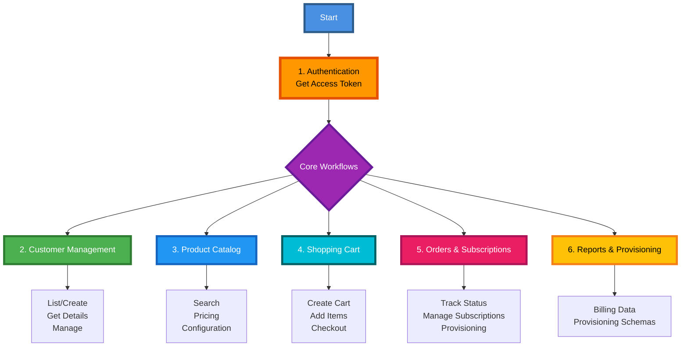

# TDSynnex API Workflow Documentation

Welcome to the **Workflows Guide** for the StreamOne® Ion APIs. This documentation is organized by functional area to help you implement specific business processes.

## API Workflow Overview

## Getting Started

1.  **Authentication**: You cannot do anything without an Access Token. Start here.
    -   **[1_Authentication.md](1_Authentication.md)**

## Core Workflows

2.  **Customers**: Manage your end-customers.
    -   **[2_Customer_Management.md](2_Customer_Management.md)** (List, Create, Get Details)

3.  **Products**: Browse the catalog and check pricing.
    -   **[3_Product_Catalog.md](3_Product_Catalog.md)** (Search, Pricing, Configuration)

4.  **Shopping**: Create carts and checkout orders.
    -   **[4_Shopping_Cart.md](4_Shopping_Cart.md)** (Cart Lifecycle, Checkout)

5.  **Orders**: Track fulfillment and subscriptions.
    -   **[5_Orders_and_Subscriptions.md](5_Orders_and_Subscriptions.md)** (Order Status, Subscription Management)

## Advanced

6.  **Reporting**: Get billing data and provisioning schemas.
    -   **[6_Reports_and_Provisioning.md](6_Reports_and_Provisioning.md)**
