# Trend Vision One API - Documentation

Benvenuto nella documentazione dell'**API Trend Vision One**, la piattaforma XDR (Extended Detection and Response) di Trend Micro che fornisce visibilità e protezione completa contro le minacce informatiche.

## 📚 Struttura della Documentazione

### OpenAPI Specification
- **[TrendVisionOne-OpenAPI-1.0.0.yaml](TrendVisionOne-OpenAPI-1.0.0.yaml)**: Specifica OpenAPI 3.0 completa dell'API

### Guide Workflow

La directory `workflows/` contiene guide dettagliate per l'utilizzo dell'API:

1. **[0_Index.md](workflows/0_Index.md)**: Panoramica generale e indice di tutte le guide
2. **[1_Authentication_and_Setup.md](workflows/1_Authentication_and_Setup.md)**: Configurazione API Key e setup iniziale ⭐ **INIZIA DA QUI**
3. **[2_Workbench_Alerts.md](workflows/2_Workbench_Alerts.md)**: Gestione alert XDR e incident response
4. **[3_Endpoint_Security.md](workflows/3_Endpoint_Security.md)**: Gestione endpoint e azioni di sicurezza

### Documentazione di Riferimento
- **API reference.json**: Specifica completa JSON dell'API Trend Vision One

## 🎯 Cosa fa Trend Vision One?

Trend Vision One è una piattaforma XDR che fornisce:
- **Rilevamento minacce avanzato** con correlazione eventi multi-layer
- **Gestione alert** centralizzata tramite Workbench
- **Response Actions** automatizzate su endpoint compromessi
- **Threat Intelligence** integrata con global threat database
- **Investigazione forense** con timeline eventi dettagliata

## 🏗️ Architettura

```mermaid
graph TB
    Client["🖥️ Applicazione Client<br/>(SOAR, SIEM, Custom App)"]
    
    API["⚡ Trend Vision One API<br/>(Regional Data Center)"]
    
    Workbench["🎯 Workbench Alerts<br/>XDR Detection Models"]
    Endpoints["🛡️ Endpoint Security<br/>Agent Management"]
    TI["🔍 Threat Intelligence<br/>IOCs & Sandbox"]
    Actions["⚙️ Response Actions<br/>Isolate/Restore/Kill"]
    
    Client -->|HTTPS + API Key| API
    
    API --> Workbench
    API --> Endpoints
    API --> TI
    API --> Actions
    
    Workbench -.->|Correlation| Endpoints
    Actions -.->|Execute on| Endpoints
    
    style Client fill:#4A90E2,stroke:#2E5C8A,stroke-width:4px,color:#fff
    style API fill:#FF9800,stroke:#E65100,stroke-width:5px,color:#000
    style Workbench fill:#E91E63,stroke:#AD1457,stroke-width:4px,color:#fff
    style Endpoints fill:#4CAF50,stroke:#2E7D32,stroke-width:4px,color:#fff
    style TI fill:#9C27B0,stroke:#6A1B9A,stroke-width:4px,color:#fff
    style Actions fill:#F44336,stroke:#C62828,stroke-width:4px,color:#fff
```



## 🚀 Quick Start

### 1. Prerequisiti
- Account Trend Vision One attivo
- Permessi per generare API Keys (ruolo Administration)
- Identificare la propria regione (US, EU, JP, AU, SG)

### 2. Ottenere API Key

1. Accedi alla console **Trend Vision One**
2. Vai su **Administration > User Accounts > API Keys**
3. Click **Add API Key**
4. Configura nome, ruolo e scadenza
5. **Copia la chiave immediatamente** (non sarà più visibile)

### 3. Identificare Base URL

Determina l'URL corretto in base alla tua regione:

| Regione | Base URL |
|---------|----------|
| 🇺🇸 United States | `https://api.xdr.trendmicro.com` |
| 🇪🇺 Europe (Germany) | `https://api.eu.xdr.trendmicro.com` |
| 🇯🇵 Japan | `https://api.xdr.trendmicro.co.jp` |
| 🇦🇺 Australia | `https://api.au.xdr.trendmicro.com` |
| 🇸🇬 Singapore | `https://api.sg.xdr.trendmicro.com` |

### 4. Prima Richiesta

```bash
curl https://api.xdr.trendmicro.com/v3.0/workbench/alerts \
  -H "Authorization: Bearer YOUR_API_KEY" \
  -H "Content-Type: application/json"
```

## 📖 Esempi di Utilizzo

### Workbench Alerts

```bash
# Lista alert critici aperti
curl "https://api.xdr.trendmicro.com/v3.0/workbench/alerts?startDateTime=2026-02-01T00:00:00Z" \
  -H "Authorization: Bearer YOUR_API_KEY" \
  -H "TMV1-Filter: severity eq 'critical' and status eq 'open'"

# Dettagli alert specifico
curl https://api.xdr.trendmicro.com/v3.0/workbench/alerts/WB-123-456 \
  -H "Authorization: Bearer YOUR_API_KEY"

# Aggiorna stato alert
curl -X PATCH https://api.xdr.trendmicro.com/v3.0/workbench/alerts/WB-123-456 \
  -H "Authorization: Bearer YOUR_API_KEY" \
  -H "Content-Type: application/json" \
  -d '{"status": "in_progress"}'
```

### Endpoint Security

```bash
# Lista endpoint gestiti
curl https://api.xdr.trendmicro.com/v3.0/eiqs/endpoints \
  -H "Authorization: Bearer YOUR_API_KEY"

# Isola endpoint compromesso
curl -X POST https://api.xdr.trendmicro.com/v3.0/response/endpoints/isolate \
  -H "Authorization: Bearer YOUR_API_KEY" \
  -H "Content-Type: application/json" \
  -d '{
    "agentGuid": "endpoint-guid-here",
    "description": "Ransomware detection - Alert WB-123"
  }'

# Ripristina connessione endpoint
curl -X POST https://api.xdr.trendmicro.com/v3.0/response/endpoints/restore \
  -H "Authorization: Bearer YOUR_API_KEY" \
  -H "Content-Type: application/json" \
  -d '{
    "agentGuid": "endpoint-guid-here"
  }'
```

## 🔐 Autenticazione

Trend Vision One utilizza **API Key authentication** tramite header Bearer:

```http
Authorization: Bearer YOUR_API_KEY
```

### Best Practices
- ✅ Genera chiavi separate per ogni integrazione
- ✅ Utilizza principio del minimo privilegio per i ruoli
- ✅ Imposta scadenze appropriate (non "never expire")
- ✅ Ruota le chiavi periodicamente
- ✅ Memorizza le chiavi in modo sicuro (secrets manager)
- ❌ Non includere mai le chiavi nel codice sorgente

## 📊 Filtri e Query

Trend Vision One supporta filtri SQL-like tramite header `TMV1-Filter`:

### Operatori Supportati
- `eq`: uguale
- `ne`: non uguale
- `gt`: maggiore di
- `lt`: minore di
- `ge`: maggiore o uguale
- `le`: minore o uguale
- `and`: AND logico
- `or`: OR logico

### Esempi di Filtri

```bash
# Alert critici aperti
TMV1-Filter: severity eq 'critical' and status eq 'open'

# Alert delle ultime 24 ore
TMV1-Filter: createdDateTime ge 2026-02-08T00:00:00Z

# Endpoint Windows online
TMV1-Filter: osName eq 'Windows' and status eq 'online'

# Multiple conditions
TMV1-Filter: (severity eq 'high' or severity eq 'critical') and status ne 'closed'
```

## 🛠️ Sviluppo Backend

Il backend Node.js/TypeScript fornisce un layer REST per semplificare l'integrazione:

```bash
cd Trend/backend
npm install
cp .env.example .env
# Configura TREND_API_KEY e TREND_BASE_URL
npm run dev
```

### Endpoint Backend

| Endpoint | Descrizione |
|----------|-------------|
| `GET /api/auth/test` | Test connettività API |
| `GET /api/alerts` | Lista alert con filtri |
| `GET /api/alerts/:id` | Dettagli alert |
| `PATCH /api/alerts/:id` | Aggiorna stato alert |
| `POST /api/alerts/:id/notes` | Aggiungi nota |
| `GET /api/endpoints` | Lista endpoint |
| `POST /api/endpoints/isolate` | Isola endpoint |
| `POST /api/endpoints/restore` | Ripristina endpoint |

## 🔄 Workflow Tipici

### Incident Response


### Alert Monitoring


## 🔧 Troubleshooting

### Errori Comuni

| Errore | Causa | Soluzione |
|--------|-------|-----------|
| 401 Unauthorized | API Key invalida o scaduta | Genera nuova API Key |
| 403 Forbidden | IP non autorizzato | Aggiungi IP alla Allow List |
| 404 Not Found | URL regione errata | Verifica Base URL corretto per la tua regione |
| 429 Too Many Requests | Rate limit superato | Implementa exponential backoff |
| 500 Internal Error | Errore lato Trend | Verifica status page, riprova dopo |

### Debug

```bash
# Test connettività
curl -v https://api.xdr.trendmicro.com/v3.0/healthcheck \
  -H "Authorization: Bearer YOUR_API_KEY"

# Verifica header risposta
curl -I https://api.xdr.trendmicro.com/v3.0/workbench/alerts \
  -H "Authorization: Bearer YOUR_API_KEY"
```

## 📚 Risorse Aggiuntive

### Documentazione Ufficiale
- [Trend Vision One Portal](https://portal.xdr.trendmicro.com)
- [API Documentation](https://automation.trendmicro.com/xdr/home)
- [Developer Community](https://success.trendmicro.com)

### Guide Workflow
- **[Authentication & Setup](workflows/1_Authentication_and_Setup.md)**: Configurazione iniziale
- **[Workbench Alerts](workflows/2_Workbench_Alerts.md)**: Gestione alert
- **[Endpoint Security](workflows/3_Endpoint_Security.md)**: Protezione endpoint

### Backend README
- **Backend**: `Trend/backend/README.md`

## 💡 Best Practices

1. **Rate Limiting**:
   - Rispetta i limiti della piattaforma
   - Implementa exponential backoff
   - Usa pagination per grandi dataset

2. **Sicurezza**:
   - Memorizza API Key in secrets manager
   - Usa HTTPS always
   - Non loggare mai le API Keys
   - Limita accesso tramite IP Allow List

3. **Performance**:
   - Usa filtri per ridurre payload
   - Implementa caching quando appropriato
   - Batch operations quando possibile
   - Monitora response time

4. **Monitoraggio**:
   - Log tutte le chiamate API
   - Traccia rate limit usage
   - Implementa alerting per errori
   - Monitor API quota

5. **Error Handling**:
   - Gestisci tutti gli HTTP status code
   - Retry con backoff per errori 5xx
   - Valida response prima di processare
   - Log errori con context completo

## 🤝 Supporto

Per domande o problemi:
1. Consulta questa documentazione
2. Verifica i log dell'applicazione
3. Controlla lo status di Trend Vision One
4. Contatta Trend Micro Support

## 📝 License

Questo backend è fornito come esempio di integrazione. Trend Vision One è un prodotto commerciale di Trend Micro.

---

**Versione**: 1.0.0  
**Ultimo aggiornamento**: Febbraio 2026  
**Compatibilità API**: Trend Vision One v3.0
