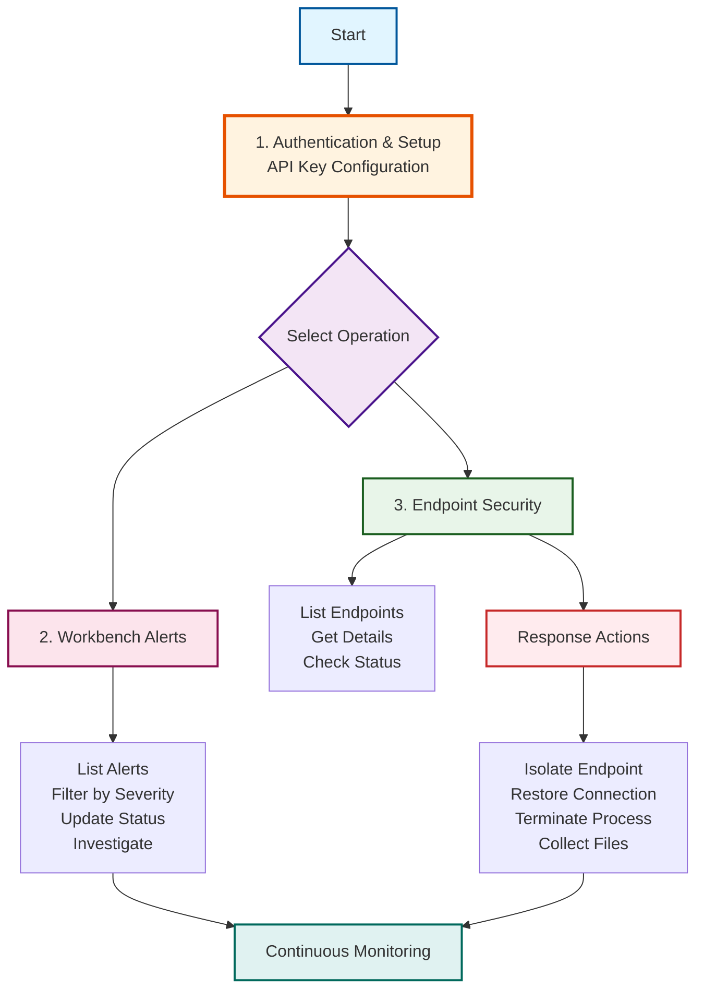

# Trend Vision One API Documentation

## API Workflow Overview

This directory contains two types of documentation:
1.  **Workflows**: Hand-written guides for common use cases.
2.  **Generated References**: Full API specs generated from the JSON reference.

## Workflow Guides

1.  **Getting Started**:
    -   **[1_Authentication_and_Setup.md](1_Authentication_and_Setup.md)**: How to get your API Key and find your regional URL.

2.  **Core Operations**:
    -   **[2_Workbench_Alerts.md](2_Workbench_Alerts.md)**: Managing XDR alerts and incidents.
    -   **[3_Endpoint_Security.md](3_Endpoint_Security.md)**: Managing and isolating endpoints.

## Reference Documentation (Generated)
*Full parameter lists and schemas for all 63 API tags.*

-   [Accounts](Generated_Docs/Accounts.md)
-   [Audit Logs](Generated_Docs/Audit%20Logs.md)
-   [Attack Surface Discovery](Generated_Docs/Attack%20Surface%20Discovery.md)
-   [Endpoint Security](Generated_Docs/Endpoint%20Security.md)
-   [Workbench](Generated_Docs/Workbench.md)
-   [Search](Generated_Docs/Search.md)
-   [Threat Intelligence](Generated_Docs/Trend%20Threat%20Intelligence%20Feed.md)
-   *(See the `Generated_Docs` folder for the full list)*
