# Authentication and Setup - Trend Vision One

## Overview
Accessing Trend Vision One APIs requires an **Authentication Token**. This is typically a long-lived API Key that you generate from the Vision One console.

## Authentication Flow


## Prerequisites
1.  A Trend Vision One account.
2.  Permissions to generate API Keys (Administration roles).

## 1. Obtain an API Key
Unlike OAuth2 flows that require a login exchange, Trend Vision One uses static API tokens for simplicity in automation.

1.  Log in to the **Trend Vision One** console.
2.  Navigate to **Administration > User Accounts > API Keys**.
3.  Click **Add API Key**.
4.  Configure:
    -   **Name**: A descriptive name (e.g., "SIEM Integration").
    -   **Role**: Select the role that defines permissions (e.g., "Standard User", "Administrator", or a custom role).
    -   **Expiration**: Set a validity period.
5.  **Copy the generated key immediately**. You cannot view it again later.

## 2. Identify Your Region
Your API requests must be sent to the correct regional data center. Using the wrong URL will result in 403/404 errors.

```mermaid
graph TD
    Start[Determine Your Region] --> Check{Check Console URL}
    
    Check -->|portal.xdr.trendmicro.com| US[🇺🇸 United States<br/>api.xdr.trendmicro.com]
    Check -->|portal.eu.xdr...| EU[🇪🇺 Europe Germany<br/>api.eu.xdr.trendmicro.com]
    Check -->|portal.xdr.trendmicro.co.jp| JP[🇯🇵 Japan<br/>api.xdr.trendmicro.co.jp]
    Check -->|portal.au.xdr...| AU[🇦🇺 Australia<br/>api.au.xdr.trendmicro.com]
    Check -->|portal.sg.xdr...| SG[🇸🇬 Singapore<br/>api.sg.xdr.trendmicro.com]
    
    US --> Use[Use This Base URL<br/>in API Calls]
    EU --> Use
    JP --> Use
    AU --> Use
    SG --> Use
    
    style Start fill:#4A90E2,stroke:#2E5C8A,stroke-width:4px,color:#fff
    style Use fill:#4CAF50,stroke:#2E7D32,stroke-width:4px,color:#fff
    style US fill:#FF9800,stroke:#E65100,stroke-width:4px,color:#000
    style EU fill:#2196F3,stroke:#1565C0,stroke-width:4px,color:#fff
    style JP fill:#9C27B0,stroke:#6A1B9A,stroke-width:4px,color:#fff
    style AU fill:#E91E63,stroke:#AD1457,stroke-width:4px,color:#fff
    style SG fill:#00BCD4,stroke:#006064,stroke-width:4px,color:#fff
```



Common Base URLs:
-   **United States**: `https://api.xdr.trendmicro.com`
-   **Europe (Germany)**: `https://api.eu.xdr.trendmicro.com`
-   **Japan**: `https://api.xdr.trendmicro.co.jp`
-   **Australia**: `https://api.au.xdr.trendmicro.com`
-   **Singapore**: `https://api.sg.xdr.trendmicro.com`

*Check your console URL to determine your region (e.g., if you log into `portal.eu.xdr...`, use the EU API).*

## 3. Making Requests
Include the token in the `Authorization` header with the `Bearer` scheme.

**Example**:
```http
GET /v3.0/oat/detections HTTP/1.1
Host: api.xdr.trendmicro.com
Authorization: Bearer <YOUR_API_KEY>
Content-Type: application/json;charset=utf-8
```

## 4. IP Allow Lists
If your organization uses IP restrictions:
1.  Go to **Administration > Network Security > IP Allow List** in the console.
2.  Add the public IP addresses of the servers/scripts that will be calling the API.
