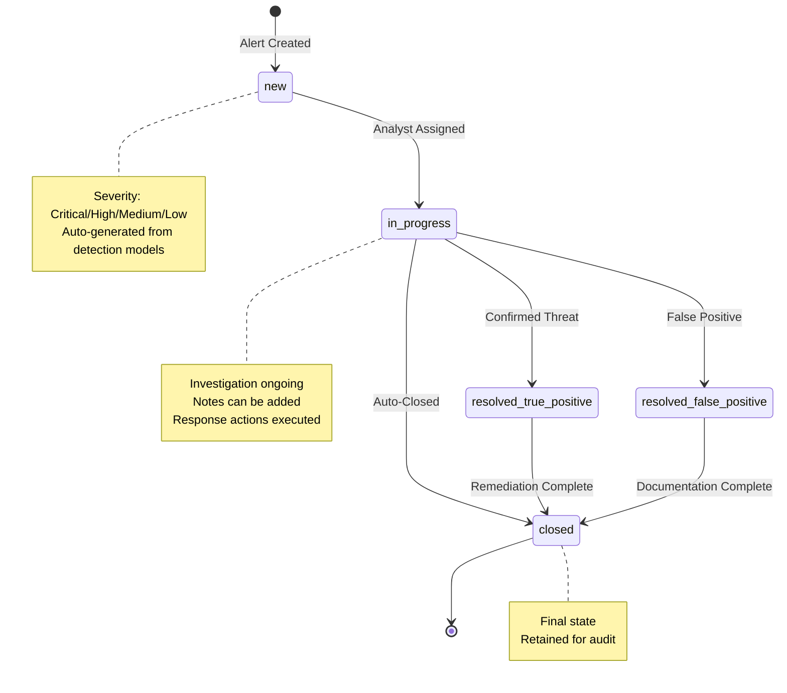

# Workbench Alerts Workflow Guide

## Overview
The **Workbench** is the heart of Trend Vision One's XDR capabilities. It aggregates correlated detection models into actionable "Alerts".
This guide explains how to programmatically retrieve these alerts and manage their lifecycle (e.g., changing status or adding notes).

## Alert Lifecycle



## Authentication
Ensure you have a valid API Key from the **[Authentication Guide](1_Authentication_and_Setup.md)**.
Include `Authorization: Bearer <key>` in all requests.

## Endpoints

| Method | Endpoint | Description |
| :--- | :--- | :--- |
| `GET` | `/v3.0/workbench/alerts` | List and filter alerts. |
| `GET` | `/v3.0/workbench/alerts/{alertId}` | Get details of a specific alert. |
| `PATCH` | `/v3.0/workbench/alerts/{alertId}` | Update alert status (e.g., In Progress, Closed). |
| `POST` | `/v3.0/workbench/alerts/{alertId}/notes` | Add an investigation note. |

---

## workflows

### Alert Processing Flow

```mermaid
graph TD
    Start[Scheduled Job<br/>Every 5 min] --> Query[GET /workbench/alerts<br/>Last 5 minutes]
    Query --> Check{New Alerts?}
    
    Check -->|No| Start
    Check -->|Yes| Loop[For Each Alert]
    
    Loop --> GetDetails[GET /workbench/alerts/{id}<br/>Full Details]
    GetDetails --> Enrich[Enrich with Context<br/>IOCs, Entities]
    
    Enrich --> Severity{Check Severity}
    
    Severity -->|Critical/High| Priority[High Priority Flow]
    Severity -->|Medium/Low| Standard[Standard Flow]
    
    Priority --> UpdateStatus1[PATCH /workbench/alerts/{id}<br/>status: in_progress]
    Priority --> CreateTicket[Create SOAR Ticket]
    Priority --> Isolate{Auto-Isolate?}
    
    Isolate -->|Yes| IsolateEP[POST /endpoints/isolate]
    Isolate -->|No| AddNote1[POST /alerts/{id}/notes]
    
    IsolateEP --> AddNote1
    CreateTicket --> AddNote1
    
    Standard --> AddNote2[POST /alerts/{id}/notes<br/>Log to SIEM]
    
    AddNote1 --> Next{More Alerts?}
    AddNote2 --> Next
    
    Next -->|Yes| Loop
    Next -->|No| Wait[Wait 5 min]
    Wait --> Start
    
    style Start fill:#e1f5ff,stroke:#01579b,stroke-width:2px
    style Priority fill:#ffebee,stroke:#c62828,stroke-width:2px
    style Standard fill:#fff3e0,stroke:#e65100,stroke-width:2px
    style IsolateEP fill:#ffcdd2,stroke:#c62828,stroke-width:3px
```

### 1. List Critical Alerts
**Goal**: Get a list of high-severity alerts created in the last 24 hours to ingest into a SOAR or Ticketing system.

**Parameters**:
-   `startDateTime` / `endDateTime`: ISO 8601 timestamps.
-   `TMV1-Filter` (Header): SQL-like filter string.

**Example Request**:
```http
GET /v3.0/workbench/alerts?startDateTime=2023-10-01T00:00:00Z HTTP/1.1
Host: api.xdr.trendmicro.com
Authorization: Bearer <key>
TMV1-Filter: severity eq 'critical' and status eq 'open'
```

**Response**:
Returns a list of alerts. **Key ID**: `id` (e.g., `WB-1234...`).

### 2. Get Alert Details
**Goal**: Retrieve the full context (impacted entities, indicators of compromise) for an alert.

**Request**:
`GET /v3.0/workbench/alerts/{alertId}`

**Response Context**:
The response includes:
-   `impactScope`: List of entities (endpoints, emails, accounts) involved.
-   `indicators`: IPs, domains, hashes found.

### 3. Update Alert Status
**Goal**: Mark an alert as "In Progress" to indicate an analyst is working on it.

**Request**:
```http
PATCH /v3.0/workbench/alerts/{alertId} HTTP/1.1
Content-Type: application/json
If-Match: "<etag_value>"  <-- Optional, typically needed for concurrency control

{
  "status": "in_progress"
}
```

### 4. Add an Investigation Note
**Goal**: Append a comment to the alert for audit trails.

**Request**:
```http
POST /v3.0/workbench/alerts/{alertId}/notes HTTP/1.1
Content-Type: application/json

{
  "content": "Ticket #1234 created in Jira. Investigating suspicious PowerShell activity."
}
```
