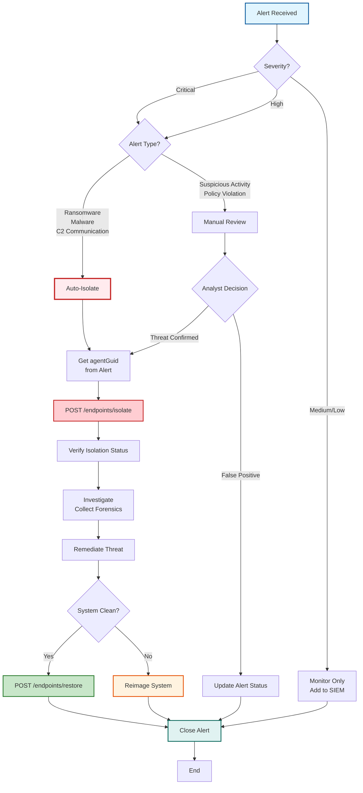

# Endpoint Security Workflow Guide

## Overview
These APIs allow you to manage the inventory of endpoints (computers/servers) protected by Trend Micro Apex One or Cloud One - Workload Security. You can also trigger response actions like isolation.

## Endpoint Response Actions Flow

```mermaid
sequenceDiagram
    participant SOAR as SOAR/Analyst
    participant API as Trend Vision One API
    participant Agent as Endpoint Agent
    participant Network as Corporate Network
    
    Note over SOAR,Network: Normal Operations
    Agent->>Network: Full Network Access
    
    Note over SOAR,Network: Threat Detected
    SOAR->>API: GET /workbench/alerts<br/>(Critical Alert Found)
    API-->>SOAR: Alert with agentGuid
    
    SOAR->>API: POST /response/endpoints/isolate<br/>{agentGuid, description}
    API->>Agent: Send Isolation Command
    Agent-->>API: Command Received
    API-->>SOAR: taskId + status: queued
    
    Agent->>Network: Block All Traffic<br/>(Except Trend Service)
    Note over Agent,Network: Endpoint Isolated
    
    Agent-->>API: Status Update: Isolated
    
    Note over SOAR,Network: Investigation & Remediation
    
    SOAR->>API: POST /response/endpoints/restore<br/>{agentGuid}
    API->>Agent: Send Restore Command
    Agent->>Network: Restore Network Access
    Agent-->>API: Status: Restored
    API-->>SOAR: taskId + status: succeeded
    
    Note over SOAR,Network: Back to Normal
    
    style SOAR fill:#e1f5ff,stroke:#01579b,stroke-width:2px
    style API fill:#fff3e0,stroke:#e65100,stroke-width:2px
    style Agent fill:#c8e6c9,stroke:#2e7d32,stroke-width:2px
```

## Authentication
Ensure you have a valid API Key from the **[Authentication Guide](1_Authentication_and_Setup.md)**.
Include `Authorization: Bearer <key>` in all requests.

## Endpoints

| Method | Endpoint | Description |
| :--- | :--- | :--- |
| `GET` | `/v3.0/ei/endpoints` | List managed endpoints. |
| `POST` | `/v3.0/response/endpoints/isolate` | Isolate an endpoint from the network. |
| `POST` | `/v3.0/response/endpoints/restore` | Restore network access to an endpoint. |
| `POST` | `/v3.0/response/endpoints/collectFile` | Collect a suspicious file from an endpoint. |

---

## Workflows

### Isolation Decision Tree



### 1. List Managed Endpoints
**Goal**: Get a list of all agents, their status, and OS information.

**Request**:
```http
GET /v3.0/ei/endpoints HTTP/1.1
Host: api.xdr.trendmicro.com
Authorization: Bearer <key>
```

**Response**:
Returns a list containing:
-   `agentGuid`: The unique ID for the agent (critical for actions).
-   `endpointName`: Hostname.
-   `ipAddress`: IP list.
-   `osName`: Operating System.

### 2. Isolate a Compromised Endpoint
**Goal**: Cut off network access for a compromised machine (except for communication with the XDR server) to prevent lateral movement.

**Steps**:
1.  Find the `agentGuid` from the **List Endpoints** API or from a **Workbench Alert**.
2.  Send the isolation command.

**Request**:
```http
POST /v3.0/response/endpoints/isolate HTTP/1.1
Content-Type: application/json

[
  {
    "agentGuid": "example-guid-1234-5678",
    "description": "Isolating via API due to Alert WB-1234"
  }
]
```

**Response**:
Returns a `taskId` and `status` (`queued`, `running`). You can poll the Task API to check for completion.

### 3. Restore Connection
**Goal**: Re-enable network access after investigation/cleanup.

**Request**:
```http
POST /v3.0/response/endpoints/restore HTTP/1.1
Content-Type: application/json

[
  {
    "agentGuid": "example-guid-1234-5678"
  }
]
```
